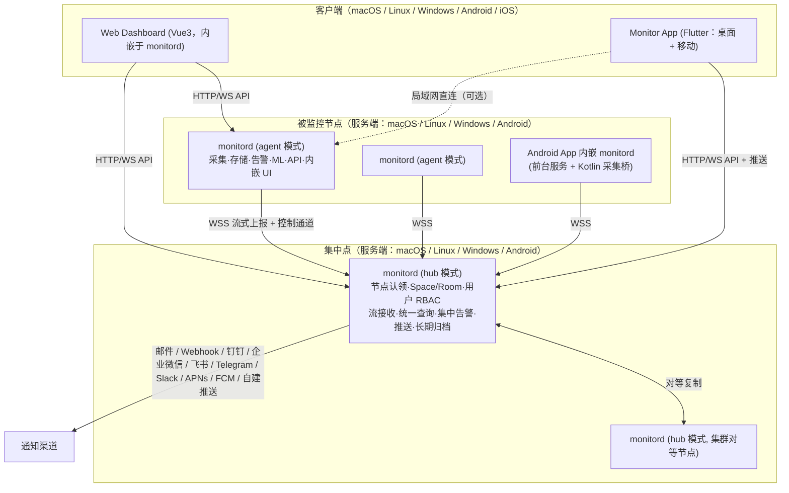
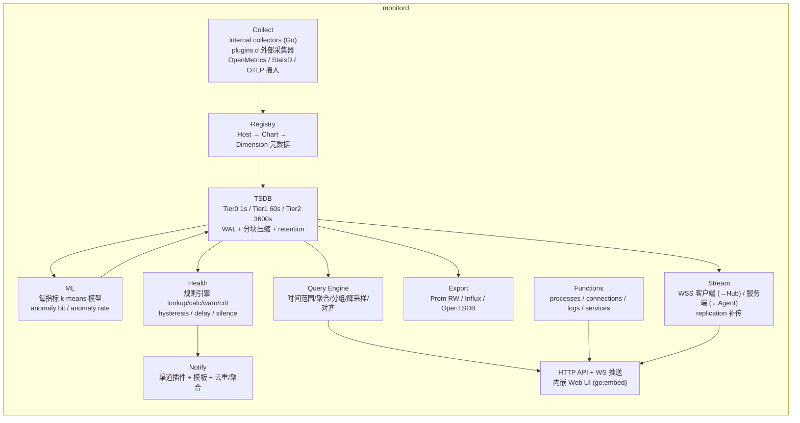
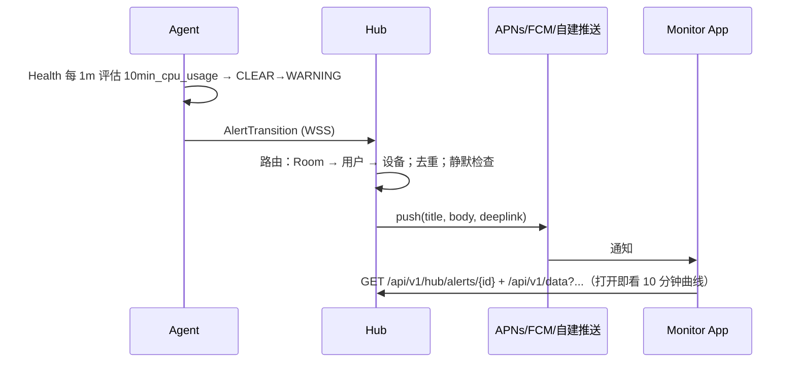

# Monitor 系统架构设计

> 目标：实现一套对标 Netdata 的实时监控平台。
> **服务端**（被监控节点上的 Agent 以及集中点 Hub）支持 macOS / Linux / Windows / Android；
> **客户端**（查看与告警接收）支持 macOS / Linux / Windows / Android / iOS。
> 能力对标见 [01-netdata-capability-study.md](01-netdata-capability-study.md)。

---

## 1. 设计原则

| 原则 | 说明 |
| --- | --- |
| **每秒真相** | 默认 1s 采集粒度，不采样；Tier0 原样落盘。 |
| **零配置** | 安装即监控：系统级采集器自动启用，常见应用（nginx/mysql/redis/docker…）自动探测。 |
| **边缘优先** | 采集、存储、告警、ML 都在节点上完成；Hub 只做统一视图、组织权限、告警路由与长期归档（可选）。 |
| **一份核心，多种角色** | Agent 与 Hub 是**同一个 Go 二进制**（`monitord`）的不同运行模式，减少四平台维护成本。 |
| **单二进制、内嵌 UI** | 服务端只有一个可执行文件，内嵌 Web Dashboard 与 API，装完即可 `http://host:19999` 访问。 |
| **只出站** | 节点到 Hub 仅需节点主动出站 TLS 连接（穿 NAT / 防火墙），Hub 不需要访问节点入站端口。 |
| **可插拔** | 采集器、通知渠道、导出器、存储后端均为接口 + 注册表；外部采集器使用语言无关的文本协议。 |
| **轻量** | 目标：Agent 常驻 CPU < 2%（单核）、RSS < 100 MB（默认采集集）、磁盘 ≈ 1 byte/sample（Tier0 压缩后）。 |

---

## 2. 总体架构



### 2.1 三类部署形态（与 Netdata 对齐）

1. **独立 Agent**：单机装 `monitord`，浏览器访问 `:19999`。
2. **Agent → Hub 集中**：Agent 通过 claim token 认领到 Hub，Hub 保存全量流数据（可配 retention），统一 Dashboard / 告警 / 推送。Hub 可再向上级 Hub 转发（Proxy），顶层 Hub 可组集群。
3. **Hub 轻模式（"不集中数据"）**：Hub 只保留元数据与告警状态，查询时实时反查在线 Agent（对应 Netdata Cloud 模式）。通过 `hub.storage = none|proxy|full` 切换。

---

## 3. 技术选型

| 层 | 选型 | 理由 |
| --- | --- | --- |
| 服务端核心（Agent / Hub） | **Go 1.25+**，单静态二进制 | 一份代码交叉编译 linux/darwin/windows/freebsd/android(arm64)；`gopsutil` 覆盖系统指标；goroutine 适合上千采集器并发。 |
| 时序库 | 自研嵌入式 **tsdb**（Gorilla XOR + delta-of-delta，分层降采样） | 对标 dbengine 的 ~1 byte/sample；无外部依赖；Android 可用。 |
| 元数据库 | **SQLite**（`modernc.org/sqlite` 纯 Go） ；Hub 大规模可切 **PostgreSQL** | 纯 Go 无 cgo，四平台一致；Hub 用 `Store` 接口抽象。 |
| 节点 ↔ Hub 通信 | **WebSocket over TLS + Protobuf 帧**（单端口 443 友好） | 对标 ACLK；穿代理/NAT；双向：上行流数据，下行控制/函数调用。 |
| 客户端 ↔ 服务端 | **REST（JSON）+ WebSocket 推送**；OpenAPI 3 描述 | Web 与 Flutter 共用同一 API；用 OpenAPI 生成 Dart 客户端。 |
| Web Dashboard | **Vue3 + Vite + TypeScript + Element Plus + uPlot/ECharts** | 与同厂 TMS/DMS 项目栈一致；uPlot 应付每秒万点的实时折线；构建产物 `go:embed` 进二进制。 |
| 多端客户端 | **Flutter 3.x**（Android / iOS / macOS / Windows / Linux） | 一套代码覆盖五端；图表用 `fl_chart`/自绘 Canvas；推送 `firebase_messaging` + APNs + 自建 WebSocket 推送兜底（国内无 GMS 场景）。 |
| Android 服务端壳 | **Kotlin**（前台服务、开机自启、Doze 白名单引导）+ gomobile AAR | Android 限制读取其他进程 /proc，用 Android API 补齐（Battery/Traffic/UsageStats/StorageStats/Thermal）。 |
| 外部采集器协议 | 行文本协议（`CHART/DIMENSION/BEGIN/SET/END`，兼容 Netdata plugins.d 语义） | 任何语言写采集器；可直接复用大量 Netdata 社区 python/bash 采集器思路。 |
| 摄入协议 | OpenMetrics/Prometheus 抓取、StatsD (UDP/TCP)、OTLP metrics (gRPC/HTTP) | 自定义应用零成本接入。 |
| 导出 | Prometheus `/metrics` 暴露、Prometheus remote write、InfluxDB line、OpenTSDB、JSON HTTP | 与既有监控体系共存。 |
| 构建/发布 | Go Modules + Makefile + GoReleaser；GitHub Actions 矩阵（linux/darwin/windows/android + flutter 五端） | 一次 tag 产出全部安装包（deb/rpm/pkg/msi/apk/ipa/dmg/AppImage）。 |

> 为什么服务端不用 Java/Spring Boot（同厂其它系统栈）：监控 Agent 需要 <100 MB 内存、秒级启动、单文件分发、在 Android 上作为库运行，JVM 都不合适；而 Hub 与 Agent 同源可最大化复用。前端与业务系统保持 Vue3 一致。

---

## 4. 服务端 `monitord` 内部架构



### 4.1 数据模型（与 Netdata 对齐，便于迁移与理解）

```
Host        { host_id(uuid), hostname, os, arch, labels{}, update_every }
Chart       { id "system.cpu", context "system.cpu", family "cpu", title, units "%",
              type line|area|stacked, priority, update_every, labels{}, plugin, module }
Dimension   { id "user", name, algorithm absolute|incremental|percentage-of-absolute-row|percentage-of-incremental-row,
              multiplier, divisor, hidden }
Sample      { ts (unix sec, tier 对齐), value float64, flags(anomaly bit, gap) }
```

- `context` 是跨主机聚合的键（Hub 上 "所有节点的 system.cpu" 即按 context 聚合）。
- `algorithm=incremental` 由 Registry 在写入前做差分，与 Netdata 语义相同（外部采集器只需报计数器原值）。

### 4.2 采集层（Collect）

**内部采集器（Go，每平台一个实现文件，`//go:build` 选择）**

| 采集器 | Linux | macOS | Windows | Android | 数据源 |
| --- | --- | --- | --- | --- | --- |
| system.cpu / load / ctxt / intr | ✓ | ✓ | ✓ | ✓ | /proc/stat、host_statistics、PDH/NtQuerySystemInformation、/proc/stat |
| system.ram / swap | ✓ | ✓ | ✓ | ✓ | /proc/meminfo、vm_stat、GlobalMemoryStatusEx、ActivityManager |
| disk.io / disk.space / inodes | ✓ | ✓ | ✓ | ✓(应用可见分区) | /proc/diskstats、IOKit、PerfCounter、StorageStatsManager |
| net.interfaces / net.sockets / tcp stats | ✓ | ✓ | ✓ | ✓(TrafficStats 全局+每 uid) | /proc/net/dev、getifaddrs、GetIfTable2 |
| processes（apps 聚合）| ✓ | ✓ | ✓ | 仅本应用+可见 | /proc/[pid]、libproc、NtQuerySystemInformation、UsageStatsManager |
| sensors（温度/风扇/电压）| ✓ hwmon | ✓ SMC(部分) | ✓ WMI(部分) | ✓ Thermal/Battery API | |
| battery / power | ✓ | ✓ | ✓ | ✓ | BatteryManager |
| gpu | ✓ nvidia-smi/intel | ✓ 部分 | ✓ nvidia-smi | - | |
| filesystems / mounts | ✓ | ✓ | ✓ | ✓ | |
| services | systemd | launchd | SCM | - | |
| containers（docker/containerd/cgroups） | ✓ | ✓(docker socket) | ✓(docker socket) | - | |
| logs | journald / 文件 | 文件 / unified log(可选) | Event Log | logcat(本应用) | |
| synthetic checks（HTTP/TCP/ICMP/DNS/TLS 证书） | ✓ | ✓ | ✓ | ✓ | 纯 Go 实现 |
| 应用采集器（nginx/apache/mysql/pg/redis/mongo/kafka/es/rabbitmq/…） | ✓ | ✓ | ✓ | ✓ | 走网络协议，与平台无关，自动探测本机端口 |

**外部采集器（plugins.d 兼容协议）**

- 放在 `plugins.d/` 目录、可执行即被发现；子进程 stdout 写入：

```
CHART system.cpu '' 'Total CPU utilization' '%' cpu system.cpu stacked 100 1 '' internal cpu
DIMENSION user '' incremental 1 100
BEGIN system.cpu 1000000
SET user = 123456
END
FUNCTION "processes" 10 "Processes running"         # 声明可远程调用的函数
```

- 采集器崩溃自动拉起（指数退避）、超时 kill；可用任意语言（Python/Bash/Node…）。
- Android 上外部采集器不可用（无法 fork 任意二进制）；改用 **Kotlin 采集桥**：Kotlin 侧以同一文本协议通过 gomobile 回调写入。

**摄入端点**：`:19999/api/v1/ingest/openmetrics`（被推）、`prometheus` 采集器（去抓）、`statsd` (`:8125/udp`)、`otlp` (`:4317`/`:4318`)。

### 4.3 存储层（TSDB）

```
data/
  meta.db                 # SQLite: host/chart/dimension 注册表、告警日志、ML 模型、claim 信息
  tier0/                  # 1s   默认 retention 14d 或 1 GiB（先到为准）
    wal/                  # 追加写 WAL，崩溃恢复
    chunks/<yyyymmdd>/    # 每 dimension 每 2h 一个 chunk：Gorilla XOR + delta-of-delta；每 chunk 附摘要(min/max/sum/count/anomaly_count)
    index/                # dimension_id → chunk 列表 (mmap)
  tier1/                  # 60s  默认 3 个月：由 tier0 在线降采样（min/max/sum/count/anomaly_count 五元组）
  tier2/                  # 3600s 默认 2 年
```

- 写路径：Registry → 内存 page（每 dimension 最近 N 秒）→ WAL → 满 chunk 压缩落盘。
- 读路径：Query Engine 按请求时间跨度与目标点数自动选 tier（"能用 tier0 就用，超出 retention 或点数过多则升级"），跨 tier 拼接对齐。
- 五元组保存使得 tier1/2 仍能给出 min/max/avg 与 anomaly rate，而不是单一均值。
- retention 时间/空间双限制，后台 GC 按 chunk 删除。
- 接口：`tsdb.Store` — Agent 与 Hub 共用；Hub 对每个远端 host 走独立命名空间。

### 4.4 健康引擎（Health）与通知（Notify）

规则文件 YAML（`health.d/*.yaml`，内置数百条随二进制发布，用户目录可覆盖/追加）：

```yaml
- template: 10min_cpu_usage          # template 按 context 应用到所有匹配 chart；alarm 只对单个 chart
  on: system.cpu
  class: Utilization
  component: CPU
  lookup: average -10m unaligned of user,system,softirq,irq,guest
  units: "%"
  every: 1m
  warn: $this > (($status >= $WARNING) ? 75 : 85)   # hysteresis：已告警时阈值降低
  crit: $this > (($status == $CRITICAL) ? 85 : 95)
  delay: down 15m multiplier 1.5 max 1h
  summary: CPU 使用率过高
  info: 最近 10 分钟 CPU 平均使用率
  to: sysadmin
```

- 表达式引擎：支持 `$this / $status / $WARNING / $CRITICAL / $now / 其它告警名引用 / 图表其它维度`，与 Netdata 兼容，便于直接移植其预置规则。
- 状态机：`UNINITIALIZED → CLEAR ↔ WARNING ↔ CRITICAL`，`REMOVED`；每次跃迁写 `alarm_log`。
- 静默：按 host/chart/alert/label 维度、时间窗口；维护窗口。
- 通知路由：`to: role` → 角色→渠道映射；Hub 模式下节点可 `notify.local = false` 交给 Hub 集中通知。
- 渠道插件接口 `notify.Channel{Send(ctx, Event) error}`：email(SMTP)、generic webhook、钉钉、企业微信、飞书、Telegram、Slack、Discord、PagerDuty、短信（阿里云/腾讯云）、**App 推送**（APNs / FCM / 自建 WSS 推送）。
- 去重与聚合：同一告警在 `repeat` 间隔内不重发；一分钟内多条合并为摘要。

### 4.5 边缘 ML（异常检测）

- 每个 dimension 训练 k-means（k=2，特征 = 最近 N 个差分值构成的滑窗），多模型（不同训练窗口）投票；训练每 `train_every=3h` 一次，用最近 `max_train_samples=14400` 点。
- 每个新样本推理得到 anomaly bit，写入 sample flags；按 chart/host 汇总 anomaly rate 图表（`anomaly_detection.*`）。
- 提供"异常顾问"查询：任意时间窗口内按 anomaly rate 排序的 chart 列表（`/api/v1/weights?method=anomaly-rate`）。
- Metric Correlations：`/api/v1/weights?method=ks2|volume` 比较"故障窗口 vs 基线窗口"，返回变化最大的指标。
- 低端设备（Android/树莓派）可 `ml.enabled=false` 或只在 Hub 上对流入数据训练。

### 4.6 流式上报与补传（Stream）

- Agent 作为 WSS 客户端主动连 Hub：`wss://hub:443/api/v1/stream`，握手携带 `api_key`（或 claim 后的节点证书）+ host 元数据。
- 帧为 Protobuf（`proto/stream.proto`）：

```
StreamFrame = oneof {
  Hello{host, version, capabilities, update_every, retention}   # 握手
  ChartDef / DimensionDef                                       # 元数据（增量下发）
  Samples{chart_id, ts, values[]}                               # 每秒一批，按 chart 打包
  AlertTransition{...}                                          # 告警跃迁（Hub 集中通知用）
  ReplicationRequest{chart_id, from, to} / ReplicationData{...} # 断线补传：Hub 告知已有的最后时间点，Agent 补发缺口
  FunctionCall{id, name, args} / FunctionResult{id, payload}    # Hub→Agent 函数调用与回包
  ConfigPush{...}                                               # Hub 下发采集/告警配置（可选、需节点允许）
  Ping/Pong
}
```

- Agent 侧本地 ring buffer（默认 1h）保证短断线不丢；长断线依赖本地 tier0 retention 做 replication。
- 多个 Hub 目的地按优先级，同一时刻只连一个；Hub 之间通过同样的流协议做 **Proxy 转发** 与 **集群对等复制**（环形，每个 Hub 既是对方的 child 也是 parent）。
- 压缩：帧级 zstd；每秒万点级别的节点约 20–40 KB/s 上行。

### 4.7 查询引擎与 API

REST 前缀 `/api/v1`（Agent 与 Hub 一致；Hub 额外 `/api/v1/hub/*`）。所有响应 JSON；支持 `format=json|csv|jsonp`。

| 端点 | 说明 |
| --- | --- |
| `GET /api/v1/info` | 节点信息、版本、能力、采集器列表、tier/retention |
| `GET /api/v1/charts` | 全部 chart 元数据 |
| `GET /api/v1/data?chart=&context=&after=&before=&points=&group=avg|min|max|sum|median&dimensions=&format=json|csv|ssv|jsonp&tier=` | 时序查询；`chart` 或 `context`（同名维度跨图求和）；`after/before` 支持相对秒与绝对时间戳；自动选 tier |
| `GET /api/v1/contexts` / `GET /api/v1/data?context=` | 跨 chart 聚合 |
| `GET /api/v2/contexts` / `GET /api/v2/nodes` / `GET /api/v2/data` | v1 子集，响应带 `"api": 2` |
| `GET /api/v1/alarms` / `alarm_log` / `alarm_variables` / `alarm_count` | 告警当前状态、历史、规则变量、计数 |
| `GET /api/v1/badge.svg?chart=&dimension=&alarm=` | 状态徽章 SVG |
| `POST /api/v1/alarms/silence` | 静默 |
| `GET /api/v1/weights?method=anomaly-rate|ks2|volume&after=&before=&baseline_after=&baseline_before=` | 异常顾问 / 关联分析 |
| `GET /api/v1/functions` / `GET /api/v1/function?function=processes&args=` | 实时函数 |
| `GET /api/v1/logs?source=journal|eventlog|file&query=&after=&before=` | 边缘日志检索（分页、全文、字段过滤） |
| `GET /api/v1/allmetrics?format=prometheus|json|shell` | 一次拿全部最新值（Prometheus 抓取用） |
| `WS /api/v1/live?charts=a,b,c` | 每秒推送最新样本（Dashboard 实时刷新，避免轮询） |
| `GET /metrics` | Prometheus 暴露格式 |
| `/api/v1/hub/*` | 见 §5 |

- 查询引擎实现：时间对齐 → tier 选择 → chunk 解码 → 分组聚合（points 目标点数）→ 维度算法（percentage 等）→ 输出。目标：任意 24h 窗口 600 点查询 < 50 ms。
- 鉴权：Agent 本地默认允许 `localhost` 与私网匿名只读（可配 `api.allow_from`、`api.token`）；Hub 强制 JWT。

### 4.8 Functions（实时诊断）

| 函数 | Linux | macOS | Windows | Android |
| --- | --- | --- | --- | --- |
| `processes`（PID/名称/CPU/内存/IO/FD/线程/用户，可排序过滤） | ✓ | ✓ | ✓ | 本应用 + UsageStats 汇总 |
| `network-connections`（进程级 TCP/UDP 套接字） | ✓ (/proc/net + inode→pid) | ✓ (lsof 等价 API) | ✓ (GetExtendedTcpTable) | 全局(受限) |
| `services`（systemd/launchd/SCM 状态） | ✓ | ✓ | ✓ | - |
| `logs`（journald / Event Log / 文件 tail） | ✓ | ✓ | ✓ | logcat(本应用) |
| `containers`（docker ps 等价） | ✓ | ✓ | ✓ | - |
| `disks`（块设备 IO） | ✓ | ✓ | ✓ | ✓ |
| `mounts`（挂载点容量） | ✓ | ✓ | ✓ | ✓ |
| `network-interfaces`（网卡计数器） | ✓ | ✓ | ✓ | ✓ |
| `streaming`（该 Hub 下所有节点连接状态） | Hub | Hub | Hub | Hub |

Hub 收到函数请求时，若目标 host 在线，通过流控制通道转发到 Agent 并回传（超时默认 10s）。

### 4.9 安全

- 进程以非 root 用户运行；需要特权的采集通过：Linux capabilities（`setcap`）；macOS/Windows 以 LaunchDaemon / Windows Service 的服务账户运行；`mon-sudo` 只允许白名单命令（对标 ndsudo）。
- 传输全 TLS（Hub 自签 CA 或 ACME）；节点认领：Hub 生成一次性 `claim token`，Agent 首次连接凭 token 换取长期节点凭证（mTLS 证书或节点 JWT），token 用后即焚。
- Hub 用户：本地账号 + 可选 OIDC/LDAP；JWT（HS256/RS256）；RBAC 角色：`admin / manager / troubleshooter / observer / billing`（对标 Netdata Cloud）。
- 审计日志：用户操作、配置下发、静默。
- Web UI 内嵌资源开启 CSP；API 限流与登录风控（可复用同厂 DMS 的 IP 限流方案）。

### 4.10 配置

- 单文件 `monitor.yaml`（对标 netdata.conf），加 `health.d/`、`collectors.d/`（每采集器 yaml）、`stream.yaml`、`notify.yaml`。
- 全部键有默认值 → 零配置可运行；`monitord config dump` 输出生效配置；支持 SIGHUP / API 热加载采集器与告警规则。

---

## 5. Hub（集中点）额外能力

Hub 通过 `monitor.yaml` 中的 `mode: hub` 启用（程序没有 `--mode` 参数），在 Agent 全部能力之上增加：

| 模块 | 说明 |
| --- | --- |
| 节点注册与认领 | `POST /api/v1/hub/claim-tokens` 生成 token；节点上线自动进入指定 Room；节点状态 `live / stale / offline`；节点标签、分组。 |
| 组织模型 | `Space`（组织）→ `Room`（节点集合，一节点可属多 Room）→ `User` 与 `Role`。 |
| 统一查询 | `context` 级跨节点聚合、按 node/label 分组、节点对比；`storage=none` 模式实时扇出到在线 Agent 再合并。 |
| 集中告警 | 汇聚所有节点告警跃迁；Room 级通知路由；告警静默、维护窗口、值班表（简版）；App 推送。 |
| 配置下发 | 对允许的节点集中编辑采集器/告警规则（灰度到 Room）。 |
| 长期归档 | `storage=full` 时按节点写自己的 tier0/1/2；tier2 可远超 Agent 本地保留。 |
| 多 Hub | Proxy（Hub → 上级 Hub 再流一遍）、Cluster（顶层 Hub 环形对等，客户端任一入口）。 |
| 客户端服务 | 用户登录、Dashboard 布局保存、收藏、分享只读链接、移动端设备注册（推送 token）。 |
| API | `/api/v1/hub/{spaces,rooms,nodes,users,roles,tokens,notifications,devices,dashboards}` |

当前 Android 服务端由 Kotlin 前台服务启动静态 `monitord` 子进程，数据落到应用私有目录；设置页提供 Agent 上报 Hub 的配置，尚无切换 Hub 模式的界面。

---

## 6. Android 服务端专项设计

Android 作为**被监控节点**是相对 Netdata 的扩展。下表保留专项设计目标，包含尚未实现的 gomobile、Kotlin 采集桥和 WorkManager；当前工程形态见表后说明及 [Android 服务端 README](../android/README.md)。

| 约束 | 对策 |
| --- | --- |
| 不能常驻任意二进制、后台进程受 Doze/电池优化限制 | 以 **前台服务（Foreground Service, type=dataSync）** 运行 gomobile 打包的 `monitord` 核心；引导用户加入电池优化白名单；`BOOT_COMPLETED` 自启；`WorkManager` 兜底拉活。 |
| Android ≥ 8 无法读取其它进程 `/proc/<pid>` | 系统整体指标走 `/proc/stat`、`/proc/meminfo`、`/proc/net/dev`（仍可读）；进程/应用维度用 `UsageStatsManager`（需用户授予 PACKAGE_USAGE_STATS）、`ActivityManager`。 |
| 无 root 无法 fork 外部采集器 | **Kotlin 采集桥**：Kotlin 采集 Battery / Thermal / Traffic / Storage / Sensor，用与 plugins.d 相同的文本协议经 gomobile 接口写入核心。 |
| 网络切换（Wi-Fi/蜂窝）频繁 | 流客户端使用短心跳 + 快速重连 + 本地 ring buffer；蜂窝下可配置"仅告警、不流指标"。 |
| 省电 | Android 上 `update_every` 默认 5s、ML 默认关、tier0 retention 默认 1 天；空闲屏幕关闭时可降为 15s。 |
| 已 root / 工控设备 | 检测 root 后自动启用完整 Linux 采集器集与外部采集器。 |

**当前 Android 项目形态**：`android/` 是独立 Kotlin App，`MonitordService` 前台服务通过 `ProcessBuilder` 启动随包分发的 `jniLibs/arm64-v8a/libmonitord.so`（实际为静态 Go 可执行文件）。它不依赖 AAR，也不嵌入 Flutter。Flutter Android 客户端由 `app/android/` 单独构建。

> iOS 未列入服务端：iOS 不允许第三方 App 长期后台运行与读取系统级指标，因此 iOS 只做客户端。

---

## 7. 客户端

### 7.1 Web Dashboard（内嵌）

- 技术：Vue3 + TS + Vite + Element Plus + uPlot（实时折线）+ ECharts（饼/热力/拓扑）。
- 页面：节点概览（Overview：所有 chart 按 section 分组、自动布局）、单 chart 全屏、Nodes 列表（Hub）、Alerts（当前/历史/静默）、Anomalies（异常顾问）、Functions（进程表、连接表）、Logs、Settings（采集器/告警规则编辑器）、Hub 管理（Space/Room/用户/Token）。
- 交互对标 Netdata：全局时间选择器、拖拽缩放、悬停跨图联动、按 dimension/instance/node/label 分组切换、无查询语言。
- 实时：`WS /api/v1/live` 每秒增量追加；页面不可见时暂停。
- 构建产物 `web/dist` 用 `go:embed` 打进 `monitord`，也可配置 `ui.cdn` 使用最新 UI。

### 7.2 Monitor App（Flutter，五端）

| 能力 | 说明 |
| --- | --- |
| 登录 Hub / 直连 Agent | 支持多 Hub、多 Space 切换；局域网 mDNS 发现 Agent 直连。 |
| 节点列表与状态 | live/stale/offline，标签筛选，健康度色块。 |
| Dashboard | 同 Web 的 chart 分组与实时刷新；桌面端支持多窗口/大屏；移动端纵向卡片。 |
| 告警 | 列表、详情、静默、确认；**推送**：iOS APNs、Android FCM；国内无 GMS 场景走自建 WSS 长连接推送（App 在前台/后台受限时降级为定时拉取），也支持华为/小米厂商通道（可选插件）。 |
| Functions / Logs | 移动端只读表格与搜索。 |
| Android 服务端开关 | Android 上 App 内可开启"把本机作为节点上报"（启动 §6 的前台服务）。 |
| 离线缓存 | 最近浏览的节点与告警缓存，弱网可看。 |

Dart API 客户端由 OpenAPI 生成；模型与 Web 端共享一份 `openapi.yaml`。

---

## 8. 代码仓库结构（Monorepo）

以下对应当前源码；根目录入口、产物与数据位置见 [README](../README.md#仓库结构)。

| 目录 | 当前职责 |
| --- | --- |
| `core/cmd/monitord/` | Go 主程序、配置加载、Agent / Hub 生命周期 |
| `core/internal/config/` | YAML 配置、默认登录密码生成与加载 |
| `core/internal/api/` | HTTP / WebSocket、认证、RBAC、内嵌 Web 资源 |
| `core/internal/collect/` | 采集框架、内置采集器、ML 与按需 Functions，平台差异由 GOOS 文件区分 |
| `core/internal/plugins/` | 外部 plugins.d 进程与文本协议 |
| `core/internal/ingest/`、`export/` | 数据摄入与对外导出 |
| `core/internal/registry/` | Host / Chart / Dimension 元数据与采样算法 |
| `core/internal/tsdb/` | 原始块、原子检查点、降采样层、保留策略和查询 |
| `core/internal/backup/` | 数据目录锁、离线备份与校验恢复 |
| `core/internal/health/` | 规则、表达式、告警与通知；`rules/` 保存内嵌 YAML 规则 |
| `core/internal/stream/`、`hub/` | Agent 上报协议、MQTT 帧、Hub 节点/组织/副本与查询扇出 |
| `web/src/`、`web/e2e/` | Vue Dashboard 与浏览器验收 |
| `app/lib/`、`app/test/`、`app/integration_test/` | Flutter 客户端、单元测试与原生集成测试 |
| `app/android/` 等平台目录 | Flutter 客户端的五端工程 |
| `android/` | 独立 Android 服务端 Kotlin 工程 |
| `plugins.d/` | 外部采集器示例 |
| `scripts/` | 构建、打包和测试脚本，见 [脚本索引](../scripts/README.md) |
| `docs/`、`.github/workflows/` | 文档和 CI / Release |

Go 单元测试与包源码放在一起；Flutter、浏览器和真实进程验收分别由各自工程及 `scripts/` 管理。`dist/`、`reports/`、各工程的 `build/` 与本地数据目录是生成输出，不提交源码库。

早期规划中的 `proto/`、根目录 `api/openapi.yaml`、`packaging/`、`core/mobile/` 和 `cmd/monitorctl/` 尚未落地。当前不为它们创建空目录；后续实现对应能力时再引入。TSDB 当前没有逐样本 WAL，不能将规划中的 WAL 当成现有持久化保证。

---

## 9. 关键流程

### 9.1 安装即监控（Linux 示例）

```
curl -fsSL https://.../install.sh | sh -s -- --claim-token <token> --hub wss://hub.example.com
```

1. 下载对应 OS/arch 的 `monitord`，安装为 systemd 服务（非 root 用户 `monitor` + capabilities）。
2. 启动 → 自动发现采集器 → 1 秒后 `http://host:19999` 可看到图表。
3. 若带 claim token → 连接 Hub → 节点出现在指定 Room。

### 9.2 告警到手机



### 9.3 断线补传

1. Agent 重连后发送 `Hello`；Hub 回复每个 chart 已存的 `last_ts`。
2. Agent 对 `last_ts < now - 1s` 的 chart 发送 `ReplicationRequest` 响应（从本地 tier0 读缺口，按 chunk 分批）。
3. 补传与实时流并行，实时优先，补传限速。

---

## 10. 非功能指标（验收目标）

| 指标 | 目标 |
| --- | --- |
| Agent CPU | 默认采集集（~2000 dimensions，1s）< 2% 单核；Android < 1% + 每日电量 < 2% |
| Agent 内存 | RSS < 100 MB（含 ML）；Android < 60 MB |
| 磁盘 | tier0 ≈ 1 byte/sample；默认 2000 dimensions 14 天 ≈ 2.4 GB 上限受 retention size 截断 |
| 端到端延迟 | 采集 → Dashboard 出现 ≤ 2 s；Agent → Hub → App ≤ 3 s |
| 查询 | 24h/600 点单 chart < 50 ms；Hub 跨 100 节点 context 聚合 < 500 ms |
| Hub 容量 | 单 Hub 1000 节点 / 200 万 samples/s（16 核 64 GB）；超过走集群 / 分层 |
| 可用性 | Hub 集群任一节点宕机客户端无感；Agent 断线 ≤ 本地 retention 均可补齐 |

---

## 11. 实施路线图

| 阶段 | 范围 | 交付 |
| --- | --- | --- |
| **M0 骨架** | Go monorepo、`monitord` 启动、Registry、tsdb tier0（WAL + chunk）、CPU/内存/磁盘/网络采集器（Linux/macOS/Windows）、`/api/v1/{info,charts,data}`、最小 Web Dashboard、GitHub Actions 三平台构建 | 单机装完能看实时图 |
| **M1 完整单机 Agent** | tier1/2 + retention、全部系统采集器、plugins.d 协议、OpenMetrics/StatsD 摄入、Health 引擎 + 内置规则 + 邮件/Webhook/钉钉/企微/飞书、WS live、Functions(processes/connections)、服务安装脚本（systemd/launchd/SCM）、Prometheus 暴露 | 对标 Netdata 单 Agent |
| **M2 Hub** | 流协议 + replication、hub 模式（claim、Space/Room、用户/RBAC/JWT）、跨节点查询、集中告警、Web Hub 管理页、Proxy 级联 | 多节点集中监控 |
| **M3 客户端** | Flutter App 五端：登录、节点、Dashboard、告警、推送（APNs/FCM/自建）、mDNS 直连 | 应用商店/桌面安装包 |
| **M4 Android 服务端** | gomobile AAR、Kotlin 前台服务与采集桥、Android 专用采集器与省电策略、Android 上运行 Hub 验证 | 安卓设备作为节点 / 小型 Hub |
| **M5 智能与日志** | 边缘 ML 异常检测、异常顾问、OpenMetrics/StatsD 摄入、Prometheus 抓取、合成检查（HTTP/TCP/Ping）、导出器（Graphite/Influx/JSON）、apache/phpfpm/memcached | 对标 Netdata 完整 Agent 能力 |
| **M6 生态** | 应用采集器扩充（mysql/pg/es/rabbitmq）、journald / Event Log 检索、OTLP、Hub 集群、Prometheus remote write、Metric Correlations（ks2/volume）、sslcheck/dns/nvidia | 生产可用 |
| **M7 Agent 对齐** | proc conntrack/softnet/ipc/md/battery；haproxy/lighttpd/consul/whois；contexts/silence/alarm_variables/allmetrics csv·shell；OpenTSDB；Telegram/Discord/PagerDuty | 对标 Netdata 单机 Agent 剩余核心面 |
| **M8 存储/时间/硬件** | proc ipv6/ipvs/nfs/zfs/btrfs/wireless/ksm/zram；mongodb/pgbouncer/chrony/ntpd/smartctl/nvme/apcupsd/lvm | 对标 Netdata 存储与时钟面 |
| **M9 队列/DNS/代理** | zookeeper/nats/varnish/squid/tomcat/traefik/bind/unbound/coredns/hdfs | 对标 Netdata 队列与边缘代理 |
| **M10 邮件/安全/日志** | postfix/exim/dovecot/fail2ban/weblog/squidlog/openldap/wireguard/samba/freeradius/tor | 对标 Netdata 邮件与边缘安全 |
| **M11 cgroup / Kubernetes** | cgroup + k8s_kubelet/kubeproxy/apiserver/k8s_state | 对标 Netdata 容器树与 K8s |
| **M12 SNMP / 长尾应用** | snmp + proxysql/clickhouse/cockroachdb/pulsar/envoy/upsd/zfspool/dmcache/filecheck/supervisord/monit | 对标 Netdata 第一批长尾 |
| **M12 续 日志/存储/DNS** | fluentd/logstash/cassandra/ceph/couchdb/couchbase/hddtemp/openvpn/beanstalk/uwsgi/powerdns/dnsmasq | 对标 Netdata 第二批长尾 |
| **M12 续 2 RAID/BMC/应用** | megacli/hpssa/adaptecraid/redfish/activemq/gearman/geth/ipfs/pihole/powerdns_recursor/rspamd/typesense | 对标 Netdata 第三批长尾 |
| **M12 续 3 DNS/Web/DB** | storcli/nginxvts/tengine/nsd/dnsdist/dnsmasq_dhcp/isc_dhcpd/puppet/openvpn_status_log/rethinkdb/yugabytedb/vernemq | 对标 Netdata 第四批长尾 |
| **M12 续 4 Web/DB/应用** | icecast/phpdaemon/pika/maxscale/nginxplus/nginxunit/docker_engine/riakkv/litespeed/boinc/spigotmc/w1sensor | 对标 Netdata 第五批长尾 |
| **M12 续 5 硬件/REST** | ap/dockerhub/ethtool/intelgpu/logind/dcgm/panos/powerstore/powervault/s3check/scaleio/smbios_memory | 对标 Netdata 第六批长尾 |
| **M12 续 6 云/SQL/SNMP** | vcsa/mssql/oracledb/sql/cloudwatch/azure_monitor/vsphere/cato_networks/snmp_traps/snmp_topology | 对标 Netdata go.d init.go 收尾（跳过 testrandom） |
| **M13 规则与查询** | 剩余系统 health.d 模板、`data?context=`、data csv/ssv/jsonp、`/api/v2` 子集、alarm_count、badge | 告警与跨图查询对齐 |
| **M14 Hub Cloud** | claim / Space / Room / OIDC / 配置下发 / 环复制 | 对标 Netdata Cloud |
| **M15 ML / Functions / 导出** | k-means、containers/disks/mounts/ifaces、Mongo 导出 | weights 对比 |
| **M16 平台** | Windows/FreeBSD 采集、Flutter Functions、Android logcat、freebsd 交叉编译 | 跨平台 CI |
| **M17 剩余缺口** | proc 剩余、libvirt/proxmox/ebpf、manage/health、v2 group_by=node、维护窗口、Kinesis/Pub/Sub、LDAP/share/ACLK、Vue context | `go test -race`、`vue-tsc`、`smoke.sh` |
| **M18 原生插件** | EDAC/SLAB/zswap/RAPL/DRM/bcache/timex；cups/xenstat/ioping/nftables/podman/ipmi；Kafka REST；v2/q + alert_transitions | 合入 main |
| **M19 内核深度（合入）** | eBPF 程序族、perf.plugin、debugfs extfrag/audit、idlejitter、apps user/group、nfacct | `go test -race`、`vue-tsc`、`smoke.sh` |
| **M20 日志与查看器（合入）** | journald 跟随流、Windows Events 分页、macos.plugin、network-viewer、systemd-units 出图 | 同上 |
| **M21 Windows.plugin（合入）** | Perflib IIS/应用池/ASP.NET/.NET/Hyper-V/SMB/NUMA/thermal/传感器/AD/Exchange/services 图 | Windows CI fixture |
| **M22 freebsd.plugin（合入）** | ZFS ARC、ipfw、net.inet*、devstat、getmntinfo | freebsd 交叉编译 |
| **M23 IBM 与残留（合入）** | ibm.d db2/as400/mq/websphere；pandas/go_expvar/am2320；lxc/ecs/containerd | 合入 main |
| **M24 查询 API 深度（合入）** | `/api/v3` 子集、`group_by=dimension`、`alert_config` CRUD、每维 anomaly bit | `go test -race`、`vue-tsc`、`smoke.sh` |
| **M25 Hub Cloud 产品（合入）** | ACLK MQTT-over-WSS、Cloud 控制台、图上异常高亮、完整 Correlations UI | Hub 冒烟 + Vue |
| **M26 集成目录（合入）** | 点名 Prometheus 原生 ID 包装（etcd/minio/vault/…）；catalog API；其余 `prom.*` | `go test -race`、`vue-tsc`、`smoke.sh` |

每个阶段都以 `scripts/smoke.sh`（后端 API 冒烟）+ 平台 e2e（Playwright Web、Flutter integration test）作为完成标准。

---

## 12. 与 Netdata 的能力对照表

| Netdata 能力 | Monitor 对应模块 | 阶段 |
| --- | --- | --- |
| 每秒采集、零配置 | `internal/collect` 自动发现 | M0/M1 |
| dbengine 三层存储 | `internal/tsdb` tier0/1/2 | M0/M1 |
| 内嵌 Dashboard :19999 | `internal/api` + `web/` embed | M0/M1 |
| plugins.d 外部采集器 | `internal/plugins`（协议兼容） | M1 |
| Health alarms/templates | `internal/health`（表达式兼容） | M1 |
| alarm-notify 多渠道 | `internal/notify` | M1 |
| Functions | `internal/functions` | M1 |
| Streaming / Replication / Parent | `internal/stream` + 配置 `mode: hub` | M2 |
| Netdata Cloud（Space/Room/RBAC/集中通知） | `internal/hub` | M2 |
| Mobile App 告警推送 | `app/`（Flutter）+ Hub push | M3 |
| ML anomaly detection / Anomaly Advisor / Metric Correlations | `internal/collect/ml.go` + `/api/v1/weights` | M5 |
| Logs（journald / Event Log） | `internal/collect/logs.go` + `/api/v1/logs` | M6 |
| Exporting | `internal/export`（Graphite / Influx / JSON / Prometheus remote write / OpenTSDB） | M5 / M6 / M7 |
| Parent Cluster | `internal/hub/cluster.go` | M6 |
| OpenMetrics / StatsD / OTLP | `internal/ingest` + `prometheus`/`statsd`/`otlp` collectors | M5 / M6 |
| Contexts / alarm silence / alarm_variables | `internal/api` | M7 |
| Telegram / Discord / PagerDuty | `internal/health/notify.go` | M7 |
| 全量差距与后续批次 | [04-netdata-gap.md](04-netdata-gap.md) | M7+ |
| IPv6/IPVS/NFS/ZFS/Btrfs/KSM/zram | `internal/collect/proc_m8.go` | M8 |
| mongodb / pgbouncer / chrony / ntpd / smartctl / nvme / apcupsd / lvm | `internal/collect` | M8 |
| zookeeper / nats / varnish / squid / tomcat / traefik / bind / unbound / coredns / hdfs | `internal/collect` | M9 |
| postfix / exim / dovecot / fail2ban / weblog / squidlog / openldap / wireguard / samba / freeradius / tor | `internal/collect` | M10 |
| cgroup / k8s_kubelet / k8s_kubeproxy / k8s_apiserver / k8s_state | `internal/collect` | M11 |
| snmp / proxysql / clickhouse / cockroachdb / pulsar / envoy / upsd / zfspool / dmcache / filecheck / supervisord / monit | `internal/collect` | M12 |
| fluentd / logstash / cassandra / ceph / couchdb / couchbase / hddtemp / openvpn / beanstalk / uwsgi / powerdns / dnsmasq | `internal/collect` | M12 续 |
| megacli / hpssa / adaptecraid / redfish / activemq / gearman / geth / ipfs / pihole / powerdns_recursor / rspamd / typesense | `internal/collect` | M12 续 2 |
| storcli / nginxvts / tengine / nsd / dnsdist / dnsmasq_dhcp / isc_dhcpd / puppet / openvpn_status_log / rethinkdb / yugabytedb / vernemq | `internal/collect` | M12 续 3 |
| icecast / phpdaemon / pika / maxscale / nginxplus / nginxunit / docker_engine / riakkv / litespeed / boinc / spigotmc / w1sensor | `internal/collect` | M12 续 4 |
| ap / dockerhub / ethtool / intelgpu / logind / dcgm / panos / powerstore / powervault / s3check / scaleio / smbios_memory | `internal/collect` | M12 续 5 |
| vcsa / mssql / oracledb / sql / cloudwatch / azure_monitor / vsphere / cato_networks / snmp_traps / snmp_topology | `internal/collect` | M12 续 6 |
| （无）Android 服务端 | `android/` + 静态 `monitord` 子进程 | M4 |
| （仅移动）五端原生客户端 | `app/` Charts / Alarms / Functions | M3 / M16 |
| Windows.plugin 进程/线程/句柄 | `internal/collect/windows.go` | M16 |
| freebsd.plugin sysctl | `internal/collect/freebsd.go` | M16 |
| Android logcat | `internal/collect/logs.go` | M16 |
| InfiniBand / tc / SCTP / NUMA / IRQ | `internal/collect/proc_m17.go` | M17 |
| libvirt / proxmox / ebpf | `internal/collect` | M17 |
| manage/health / alarm_summary / share / LDAP | `internal/api` | M17 |
| Kinesis / Pub/Sub | `internal/export` | M17 |
| EDAC / SLAB / zswap / RAPL / DRM / bcache / timex | `internal/collect/proc_m18.go` | M18 |
| cups / xenstat / ioping / nftables / podman / ipmi | `internal/collect` | M18 |
| Kafka REST | `internal/export` | M18 |
| Prometheus 点名原生 ID 包装 | `internal/collect/prom_profile.go` | M26 |
| eBPF 程序族 / perf / extfrag / idlejitter | `internal/collect` | M19 |
| journald 流 / macos / network-viewer / systemd-units | `internal/collect` | M20 |
| Windows.plugin Perflib | `internal/collect/windows.go` | M21 |
| freebsd.plugin ZFS/ipfw/net.inet | `internal/collect/freebsd.go` + `freebsd_m22.go` | M22 |
| ibm.d / pandas / lxc/ecs/containerd | `internal/collect` | M23 |
| API v3 / group_by=dimension / alert_config / 每维 anomaly | `internal/api` + `collect/ml.go` + Vue MetricChart | M24 |
| Cloud 控制台 / 图上异常高亮 / ACLK MQTT | `web/` + `internal/hub` + `internal/stream` | M25 |
