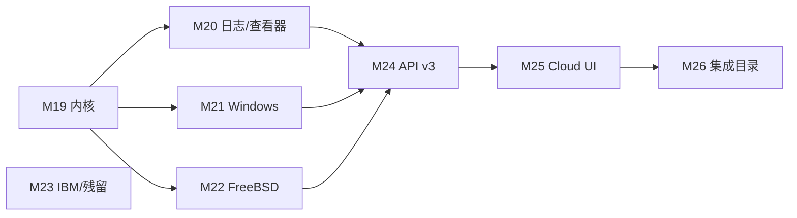

# Monitor 全量移植 Netdata：差距清单与后续计划

> 对照 [Netdata](https://github.com/netdata/netdata) Agent + Cloud 全表面。
> **目标：全部搬过来**（图表 ID / 语义对齐；目标不存在则零配置自动禁用）。
> Prometheus / StatsD / OTLP / plugins.d 是**过渡覆盖**，不是终点：能原生采集的都做成 Go 采集器。
> **不要重做 go.d**：`init.go` 除故意跳过的 `testrandom` 外已打勾。

## 0. 现状一句话（M0–M18、M23 合入 main；M22 本轮）

Agent 主路径（采集 → 存 → 告警 → 流 → 查）和 **go.d 应用目录已经对齐**。
剩下主要是 **eBPF/perf 内核探针、Windows Perflib、Cloud 产品面**。FreeBSD 插件剩余由本轮 M22 补齐；M23 IBM/pandas/容器运行时已合入。

| 面 | 完成度 | 说明 |
| --- | --- | --- |
| go.d 应用采集器 | **完成** | 除 `testrandom`；约 154 个原生模块 |
| Linux proc / debugfs 常规图 | **完成** | 含 InfiniBand、tc、EDAC、SLAB、zswap、RAPL、DRM、bcache、timex |
| 原生 C 插件便携近似 | **骨架完成** | cups / xenstat / ioping / nftables / ipmi / ebpf(bpftool) / journalctl / wevtutil |
| Windows.plugin | **骨架** | 进程/线程/句柄 + Function `windows-services`；缺 Perflib 全家桶 |
| freebsd.plugin | **完成（M22）** | sysctl 全家桶 + ZFS ARC/trim + ipfw + gstat/df/netstat 近似；非 FreeBSD 自动禁用 |
| Hub / Cloud | **骨架** | claim/Space/Room/OIDC/环复制/LDAP/share；缺真 ACLK MQTT 与 Cloud 控制台 |
| 850+ Prometheus 集成名 | **过渡覆盖** | 走已有 `prometheus` 采集器（`prom.*` ID），不逐个原生化 |

本次合并后 `monitord -list-collectors` 实测174个注册模块；注册数量不代表真实端点验收。尚无统一覆盖率分母，不给出 Agent 或集成覆盖百分比。

## 1. 现在有什么（M0–M18）

`cpu` `load` `mem` `disk` `diskspace` `net` `uptime` `apps` `systemd` `docker` `nginx` `redis` `apache` `phpfpm` `memcached` `mysql` `postgres` `elasticsearch` `rabbitmq` `proc`（intr/forks/熵/fd/PSI/IPv4+IPv6 SNMP、conntrack、softnet、IPC、mdstat、battery、IPVS、NFS、ZFS、Btrfs、wireless、KSM、zram、InfiniBand、QoS/tc、SCTP、UDP-Lite、synproxy、NUMA、pagetype、IRQ/softirq 明细、EDAC、SLAB、zswap、RAPL、DRM、bcache、timex）`sensors` `netstat` `statsd` `prometheus` `otlp` `httpcheck` `portcheck` `ping` `sslcheck` `dnsquery` `nvidia` `logs` `ml` `haproxy` `lighttpd` `consul` `whoisquery` `mongodb` `pgbouncer` `chrony` `ntpd` `smartctl` `nvme` `apcupsd` `lvm` `zookeeper` `nats` `varnish` `squid` `tomcat` `traefik` `bind` `unbound` `coredns` `hdfs` `postfix` `exim` `dovecot` `fail2ban` `weblog` `squidlog` `openldap` `wireguard` `samba` `freeradius` `tor` `cgroup` `k8s_kubelet` `k8s_kubeproxy` `k8s_apiserver` `k8s_state` `proxysql` `clickhouse` `cockroachdb` `pulsar` `envoy` `upsd` `zfspool` `dmcache` `filecheck` `supervisord` `monit` `snmp` `fluentd` `logstash` `cassandra` `ceph` `couchdb` `couchbase` `hddtemp` `openvpn` `beanstalk` `uwsgi` `powerdns` `dnsmasq` `megacli` `hpssa` `adaptecraid` `redfish` `activemq` `gearman` `geth` `ipfs` `pihole` `powerdns_recursor` `rspamd` `typesense` `storcli` `nginxvts` `tengine` `nsd` `dnsdist` `dnsmasq_dhcp` `isc_dhcpd` `puppet` `openvpn_status_log` `rethinkdb` `yugabytedb` `vernemq` `icecast` `phpdaemon` `pika` `maxscale` `nginxplus` `nginxunit` `docker_engine` `riakkv` `litespeed` `boinc` `spigotmc` `w1sensor` `ap` `dockerhub` `ethtool` `intelgpu` `logind` `dcgm` `panos` `powerstore` `powervault` `s3check` `scaleio` `smbios_memory` `vcsa` `mssql` `oracledb` `sql` `cloudwatch` `azure_monitor` `vsphere` `cato_networks` `snmp_traps` `snmp_topology` `freebsd` `windows` `libvirt` `proxmox` `ebpf` `cups` `xenstat` `ioping` `nftables` `podman` `ipmi` `db2` `as400` `mq` `websphere` `pandas` `go_expvar` `am2320` `lxc` `ecs` `containerd`。

平台骨架已齐：三层 TSDB、Health 表达式、plugins.d、Child→Parent 流、Hub 查询扇出、RBAC、异常顾问（k-sigma / ks2 / volume / k-means）、Graphite/Influx/JSON/Prom remote write/OpenTSDB/Mongo/Kinesis/PubSub/Kafka REST、Webhook/Slack/SMTP/钉钉/企微/飞书/Telegram/Discord/PagerDuty、Vue Dashboard、Flutter Functions、Android logcat。

## 2. 还差什么（M18 之后，按子系统）

原则：下列「近似」不算完成。图表 ID 必须对齐 Netdata；CLI 包装可以先落地，但要在完成标准里写明与 C 插件的语义差。

### 2.1 Linux 内核深度（最高优先级）

| 状态 | Netdata 插件 / 模块 | 我们现在 | 目标 |
| --- | --- | --- | --- |
| 近似 | `ebpf.plugin` | `bpftool prog show` → 程序数/memlock/run_time | 真探针：cachestat / dcstat / disk / fd / filesystem / hardirq / oomkill / process / socket / vfs / mdflush / mount / shm / swap / sync；与 apps / cgroup 关联 |
| 无 | `perf.plugin` | — | PMU：`perf_event_open` 或 `perf stat` → `perf.cpu.*` / `perf.hw.*` |
| 部分 | `debugfs.plugin` | zswap / RAPL / sensors 已有 | 补 **NUMA extfrag**、**audit**（`/sys/kernel/debug/extfrag`、audit backlog） |
| 近似 | `nfacct.plugin` | `nft list counters` | netfilter acct（nfacct / conntrack 字节会计）；无 nfacct 时保留 nft |
| 近似 | `freeipmi.plugin` | `ipmitool sdr` | 优先 `ipmi-sensors`/`freeipmi`；回退 ipmitool |
| 无 | `idlejitter.plugin` | — | 用户态 idle 抖动 microseconds |
| 部分 | `apps.plugin` | 按进程组 cpu/mem/io | 补 **user / user group** 分解图 |

### 2.2 日志 / 查看器 / 其它 OS 插件

| 状态 | Netdata | 我们现在 | 目标 |
| --- | --- | --- | --- |
| 近似 | `systemd-journal.plugin` | `journalctl` 一次性查询 | 跟随流、字段过滤、boot/unit/priority、Function 对齐 |
| 近似 | `windows-events.plugin` | `wevtutil` + `channel=` | ETW/Evtx 分页、XPath、Function 对齐 |
| 无 | `macos.plugin` / `macos-logs.plugin` | gopsutil 通用 cpu/mem/disk | mach host_info、powermetrics 可选、统一日志 `log show` |
| 无 | `network-viewer.plugin` | Function `network-connections` | 连接×进程实时表（inode→pid），与 Netdata Function 列对齐 |
| 部分 | `systemd-units.plugin` | systemd cgroup cpu/mem/io | 单位状态/失败/重启计数图 + Function |
| 无 | `profile.plugin` | — | Agent 自身 CPU/锁剖析（可选，默认关） |

### 2.3 Windows.plugin（Perflib 全家桶）

M16 只有 `system.processes/threads/handles/ctxt` + Function `windows-services`。Netdata `windows.plugin` 还缺：

| 批次优先级 | Perflib / 模块 | 图表族（对齐 Netdata ID） |
| --- | --- | --- |
| 高 | processor / memory / objects / processes / storage / network | CPU 队列、内存池、磁盘物理/逻辑、网卡 |
| 高 | web-service（IIS）、asp、netframework | IIS 请求/队列、ASP.NET、.NET CLR |
| 中 | hyperv、smb、thermalzone、numa、terminal-services | Hyper-V VM、SMB、温度、NUMA、RDS |
| 低 | ad / adcs / adfs / exchange | 仅当角色存在时自动启用 |
| 中 | GetServicesStatus **出图**（不仅 Function）、GetSensors、GetPowerSupply、GetHardwareInfo | `windows.service.*`、传感器、电源、硬件清单 |

无 CGO PDH 时走 WMI `Win32_PerfRawData_*` / `typeperf`；Init 失败即禁用。

### 2.4 freebsd.plugin（M22 本轮）

M16 骨架 + M22 剩余：sysctl（syscalls / pgfaults / swapio / RAM 明细 / available / active_processes / cpu freq / hw.intrcnt / net.isr / net.inet* / inet6）、`kstat.zfs` ARC + zio trim、`ipfw -a list`、`gstat`/`df`/`netstat` 近似 devstat / getmntinfo / getifaddrs。

与 C 插件的语义差：`net.inet.tcp.stats` 等内核结构体无 CGO 不解码，fixture / 点分 sysctl 键才出 TCP 明细；gstat `-b` 在无累计计数时按速率行映射。gopsutil 已占用的 `disk.*` / `disk_space.*` / `net.*` ID 不再重复建图。

### 2.5 IBM / python.d 残留 / 容器专用

| 状态 | 模块 | 说明 |
| --- | --- | --- |
| **M23** | ibm.d `db2` / `as400` / `mq` / `websphere` | CLI/HTTP 便携实现（`db2`/`isql`/`dspmq`/`runmqsc`/PMI JSON）；无 DSN/命令则禁用。真 ODBC CGO 仍可选后续 |
| **M23** | python.d `pandas` / `go_expvar` / `am2320` | pandas 抓 JSON/CSV 首行（**不** eval Python）；go_expvar `/debug/vars`；am2320 sysfs |
| **M23** | 容器运行时 | Docker / Podman / 通用 cgroup / k8s 之外：`lxc`、`ecs`、`containerd` |
| 近似 | Kafka | 导出走 Kafka REST；采集可走 prometheus。原生 broker 协议仅在需要原生 ID 时做 |

### 2.6 API / 查询 / ML / Dashboard

| 状态 | 能力 |
| --- | --- |
| 有 | v1 全套常用端点；v2 contexts/nodes/data/q/badge；`group_by=node`；alert_transitions；manage/health |
| **未做** | `/api/v3`；`group_by=dimension`；`alert_config`（单条规则 CRUD）；chart 异常高亮（每维 anomaly bit） |
| **未做** | Metric Correlations 完整 UI（现在只有 Weights 面板窗口输入） |
| 近似 | `info.aclk` 语义字段；流仍是 WebSocket，**不是 MQTT over WSS** |
| **未做** | Cloud 控制台产品面（节点清单/房间拓扑/告警路由可视化，不只 API） |

### 2.7 明确不做 / 延后

| 项 | 策略 |
| --- | --- |
| go.d 已实现模块 | **不再移植** |
| `testrandom` | 永远跳过 |
| 850+ Prometheus 集成名 | 继续用 `prometheus` 采集器；只有客户点名原生 chart ID 才单开 |
| charts.d bash 编排器 | 已有 plugins.d；不内嵌 bash 解释器 |
| 真 CGO eBPF CO-RE | M19 先 `cilium/ebpf-go` **可选 tag** + bpftool/tracefs 回退；默认静态二进制仍无 CGO |
| Netdata Cloud SaaS 账号体系 | 用自建 Hub 对等，不对接 netdata.cloud 账号 |

## 3. 分批计划

原则不变：每批可合并、可测、图表 ID 对齐、目标缺失即禁用。完成标准一律 `go test -race`、`vue-tsc`、`scripts/smoke.sh`。

### 3.1 已完成（M7–M18）

| 批次 | 搬什么 | 状态 |
| --- | --- | --- |
| **M7** | proc 五件套；haproxy/lighttpd/consul/whoisquery；contexts/silence/variables；OpenTSDB；Telegram/Discord/PagerDuty | 合入 |
| **M8** | ipv6/ipvs/nfs/zfs/btrfs/wireless/ksm/zram；mongodb/pgbouncer/chrony/ntpd/smartctl/nvme/apcupsd/lvm | 合入 |
| **M9** | zookeeper/nats/varnish/squid/tomcat/traefik/bind/unbound/coredns/hdfs | 合入 |
| **M10** | postfix/exim/dovecot/fail2ban/weblog/squidlog/openldap/wireguard/samba/freeradius/tor | 合入 |
| **M11** | cgroup + k8s_kubelet/kubeproxy/k8s_state/k8s_apiserver | 合入 |
| **M12 … 续 6** | go.d init.go 收尾（跳过 testrandom） | 合入 |
| **M13** | 系统 health.d；data context；csv/ssv/jsonp；v2 子集；badge | 合入 |
| **M14** | Hub claim/Space/Room/OIDC/配置下发/环复制 | 合入 |
| **M15** | k-means ML、Functions、Mongo 导出 | 合入 |
| **M16** | Windows/FreeBSD 骨架、Flutter Functions、Android logcat | 合入 |
| **M17** | proc 剩余 + libvirt/proxmox/ebpf 近似；manage/health；维护窗口；Kinesis/Pub/Sub；LDAP/share | 合入 |
| **M18** | EDAC/SLAB/zswap/RAPL/DRM/bcache/timex；cups/xenstat/ioping/nftables/podman/ipmi；Kafka REST；v2/q | 合入 |

### 3.2 后续批次（M19–M26）

| 批次 | 搬什么 | 为什么现在做 | 完成标准（额外） |
| --- | --- | --- | --- |
| **M19 内核深度** | eBPF 程序族（tracefs/`bpftool`/可选 cilium）；`perf`；debugfs extfrag+audit；idlejitter；nfacct 回退增强；apps user/group | Linux 服务器与 Netdata 差异最大的一块 | fixture 解析 `/sys/kernel/debug`、`perf stat` 文本；无权限自动禁用 |
| **M20 日志与查看器** | journald 跟随流；Windows Events 分页；macos.plugin + macos-logs；network-viewer；systemd-units 出图 | Functions/日志是排障主路径 | Function 列与 Netdata 对齐的单测；macOS 交叉编译 |
| **M21 Windows.plugin** | Perflib：processor/memory/storage/network/IIS/ASP.NET/.NET/Hyper-V/SMB/NUMA/thermal/services 图 | Windows 目前几乎只有进程计数 | WMI/typeperf fixture；无角色则禁用；Windows CI |
| **M22 freebsd.plugin（本轮）** | ZFS ARC、ipfw、net.inet*、devstat、getmntinfo、getifaddrs、swap/RAM/pgfaults | FreeBSD 骨架太薄 | sysctl fixture + `GOOS=freebsd` 交叉编译 |
| **M23 IBM 与残留应用（合入）** | ibm.d db2/as400/mq/websphere（CLI/HTTP，无 CGO）；pandas/go_expvar/am2320；lxc/ecs/containerd | 长尾，不挡主路径 | 无驱动/无 socket 禁用 |
| **M24 查询 API 深度** | `/api/v3` 子集；`group_by=dimension`；`alert_config` CRUD；每维 anomaly 写入 data 响应 | Cloud UI 和关联分析的前置 | API 单测 + smoke 新路径 |
| **M25 Hub Cloud 产品** | 真 ACLK（MQTT over WSS 或保持 WS 并完整对等语义）；Cloud 控制台；告警路由可视化；图上异常高亮；完整 Correlations UI | 产品面对齐，不是再堆采集器 | Hub 双节点冒烟；Vue 面板 |
| **M26 集成目录** | 仅为**点名需要原生 ID** 的 Prometheus 集成做包装；目录文档化「prom.* vs 原生」 | 850+ 名不值得逐个手写 | 文档 + 可选 codegen，不扩 go.d 重复 |

### 3.3 批次依赖

M21 / M22 / M23 互不阻塞，可并行开 PR。M24 依赖前面采集面稳定后再动查询协议。M25 依赖 M24。M23 可随时插空。

## 4. 本轮（M22）交付清单

freebsd.plugin 剩余，不碰 go.d，不扩 eBPF/Windows（M19/M21 由其它 PR）。

1. **sysctl 扩展**：`system.syscalls` `mem.pgfaults` `mem.swapio` `system.ram` 明细 `mem.available` `system.active_processes` `cpu.scaling_cur_freq` `system.interrupts` `system.softnet_stat`
2. **net.inet***：`ipv4.tcpsock/tcppackets/tcperrors/tcphandshake`、UDP/ICMP/IP、`ipv6.packets/errors/icmp`（点分键；opaque 结构体不解码）
3. **ZFS**：复用 `zfs.arc_size` 等 + `zfs.l2_size/bytes/memory_ops/important_ops/arc_size_breakdown/trim_*`
4. **ipfw**：`ipfw.mem/packets/bytes/active/expired`（`ipfw -a list`）
5. **devstat / mnt / if**：`gstat` / `df -kP` / `netstat -ibn`，已有同 ID 则跳过
6. **health.d** `system_m22.yaml`：`zfs_memory_throttle` / `freebsd_ipfw_drops` / `freebsd_softnet_drops`
7. **测试**：sysctl+ipfw+gstat+df+netstat fixture 两拍；`GOOS=freebsd go test -c`

下一轮仍是 M19 内核深度（其它 Chat 的 M20/M21 并行）。

## 4b. 下一轮（M19）交付清单

内核深度，不碰 go.d，不扩 Windows/FreeBSD（留给 M21/M22）。

1. **eBPF 程序族（便携优先）**
   - 新文件建议：`core/internal/collect/ebpf_progs.go`（或按 program 拆）
   - 数据源优先级：`/sys/kernel/debug/tracing` / bpffs 统计 → `bpftool prog show --json` 扩展 → 可选 `cilium/ebpf-go`（`//go:build linux,cgo,ebpf`）
   - 图表 ID 对齐 Netdata：`ebpf.cachestat` `ebpf.dcstat` `ebpf.disk` `ebpf.fd` `ebpf.vfs` `ebpf.oomkill` `ebpf.process` `ebpf.shm` `ebpf.swap` `ebpf.sync` `ebpf.mdflush` `ebpf.mount` `ebpf.hardirq` 等
   - 无 `CAP_BPF` / debugfs 则保持现有 bpftool 库存图，程序族禁用而不是整模块失败
2. **perf.plugin**
   - `perf stat -a -x,` 或 `unix.PerfEventOpen`（linux-only 文件）
   - 图：`perf.cpu`（cycles/instructions/cache-misses/branch-misses）
   - 容器无 perf_event_paranoid 权限 → Init 失败禁用
3. **debugfs 剩余**：NUMA `extfrag`、kernel `audit` backlog
4. **idlejitter**：用户态 sleep 抖动，图 `system.idlejitter`
5. **apps user/group**：`apps.cpu_user` / `apps.cpu_group`（以及 mem 对应）；groups 来自 `/etc/passwd`+`/etc/group` 或 gopsutil
6. **nfacct**：若 `nfacct list` 可用则出 `netfilter.nfacct`；否则保持 nftables
7. **health.d** `system_m19.yaml`：oomkill、extfrag 高、perf 不可用不必告警（采集禁用即可）
8. **测试**：纯 fixture，不在 CI 加载真实 kprobe；`GOOS=linux` 单测 + 其它 OS stub

## 4.1 M23（已合入 main）

与 M19–M22 并行落地。默认无 CGO；Init 失败即禁用。

1. `db2` / `as400` / `mq` / `websphere`：ibm.d 图表 ID 子集（connections/locking/deadlocks、cpu/jobs/ASP、queue managers/depth、JVM heap/threads/sessions）
2. `pandas` JSON/CSV 首行；`go_expvar` memstats；`am2320` sysfs
3. `lxc` / `ecs` / `containerd` 状态图 + Functions
4. health.d `system_m23.yaml`

每完成一批，把本节的「未做」改成「有」，不要另开平行文档。

## 5. 工程约束（各批通用）

- 图表 ID / context / 单位 / algorithm（absolute vs incremental）对齐 Netdata。
- Init 失败进入后台退避重试，不影响其它模块；手动禁用不重试。
- 默认静态二进制、无 CGO；需要 CGO 的能力用 build tag，CI 主矩阵仍 `CGO_ENABLED=0`。
- 不跑全量 Maven；Go 变更用已有 `go test` / 单测类，前端 `vue-tsc`。
- 新 API 必须进 `scripts/smoke.sh`。
- Windows 路径禁止 `:` 等非法字符（RAPL 已踩过）。
- Health 锁不可重入；通知计数先 `markNotified` 再 `Add`。
- 分支名 `cursor/netdata-mNN-<topic>-8c7b`，PR 对 `main`。

## 6. 稳定性阶段验收（2026-09-22）

| 能力 | 实现及依赖 | 自动验证 | 真实环境 / 待完成 |
| --- | --- | --- | --- |
| OIDC | 标准 go-oidc 验证签名/issuer/audience/expiry，nonce、PKCE、浏览器 state，限时会话及 logout；OIDC 单独配置时禁止匿名管理员 | 签名模拟 IdP 正反例、越权/过期/退出 | 外部 IdP 联调待验收 |
| HTTPS 采集 | 13 个曾共用 insecureClient 的模块（含合并后的 Proxmox）默认校验证书；tls.ca_file、tls.insecure_skip_verify | 本地 TLS 服务：不可信拒绝、CA 信任成功、显式不安全成功 | K8s / BMC / 存储真实设备待验收 |
| MSSQL | 依赖 sqlcmd；命中率使用 numerator/base，缺失计数不写零 | 比例/缺失/零分母回归 | SQL Server 实机待验收 |
| 采集器恢复 | 初始化失败 5 秒至 60 秒退避后台重试；手动禁用不重探；重新启用先初始化 | 离线恢复、并发启停 race 回归 | 长时间运行待验收 |
| Web / Agent / Hub | Go >=1.25，CI 固定1.27.1；Node 24.19.0 | make all、make test（含 race/vet）、scripts/smoke.sh 通过 | 本轮 macOS amd64；其他平台以 CI 结果为准 |
| 历史/持久化/HA | 三层 TSDB、Agent 补传已有；现有 Hub ring 仅最后样本 | 现有单测通过 | 阶段3继续；不得称为完整 HA |
| Flutter / Android | 客户端、Kotlin 服务壳已有 | 本轮未执行移动端构建 | 安全存储、后台恢复、真机验收继续 |

CI 与 Release 使用同一 Go/Node 版本；开发机不再依赖 PATH 中的旧 Node 18。
TLS 行为变更：自签名端点应配置私有 CA，不再静默接受任意证书。

## 7. 阶段3：持久化、备份和历史复制

- TSDB 检查点默认 30s；块内容同步后原子替换，Unix 同步所在目录；Windows 目录同步由系统管理。
- `/api/v1/info` 的 `db.persistence` 报告最后成功检查点的开始/完成时间及错误。**30s 是调度间隔，不是硬性丢失上限**：异常退出可能丢失上次成功检查点之后的数据；尚未实现逐样本 WAL 或跨层事务。
- 检查点最多8个并发写任务，不阻塞正常采样；写块期间保留可查询的缓冲区，避免瞬时数据空洞。未结束的 rollup bucket 也进入检查点。
- `monitord -config monitor.yaml -data-dir ./data -backup-dir /path/new-backup`：停服备份，SHA-256 清单，拒绝正在使用的数据目录。
- `monitord -config monitor.yaml -data-dir /path/new-data -restore-from /path/new-backup`：校验后恢复，只允许新目录；失败留下的目录不应启动使用，应检查原因并换一个新目录重试。备份包含监控数据和可能的 Hub 凭证，应限制访问。
- Hub ring 改成每图每次最多4页、每页5分钟原始分辨率历史；仅HTTP成功后推进进度，保留60s重叠；速率不再二次计算，副本身份跨重启保留。
- **HA边界**：还不是共识集群或任意故障零丢失；60s重叠不能覆盖任意慢检查点或副本盘丢失。完整重建可重启源Hub重新回放尚在保留期内的历史；超8MiB单页会记录错误而不会错误推进游标。
- 验证：备份占用/损坏/覆盖保护，检查点后异常退出的 raw/rollup 恢复，查询与检查点并发，Hub历史补传及拒绝重试，进程级 SIGKILL 与备份恢复比对。复现：`make verify-durability`。

## 8. 阶段4：日常使用与客户端恢复

- Dashboard：6小时/24小时/7天窗口，每图最多1200历史点；长窗口每30秒重新降采样，不累积逐秒数组；异步查询过期响应丢弃，卸载后不再更新图表。
- 节点健康卡片显示在线/过期/离线、最后数据和严重告警；图表区分暂无数据与过期；采集器悬停显示失败原因；存储落盘失败直接显示。
- Flutter：移除旧版 SharedPreferences 中的明文 token，凭证仅保留本次运行，连接表单明确提示重启后重新输入；WebSocket 使用编码子协议，URL 不再携带 token。平台安全存储和推送仍待后续真实设备验收。
- Android：子进程崩溃 1s→60s 重启退避，稳定运行一分钟后重置；手动停止取消重试；Android 15 dataSync 超时主动停止，启动限制不再冒充永久保活。
- Android 15+ 不从 BOOT_COMPLETED 启动 dataSync：需要打开应用启动。依据：https://developer.android.com/about/versions/15/behavior-changes-15 。仍需真机验证后台耗电和系统回收行为。
- 验证：Vue生产构建通过，Flutter analyze与6项单测通过。浏览器控制工具超时，UI目视验收未完成；Android服务端调试APK构建通过；Flutter macOS完整打包因缺少CocoaPods未通过，不能将代码检查等同于真机通过。

## 9. 阶段5：可复现的容量与运行基线

- `monitord -list-collectors` 输出编译进二进制的模块名；它只说明注册，不说明依赖满足或真实设备验证通过。
- `make bench`：2000条序列的内存追加、24小时历史读取并聚合到600点、2000条序列的同步检查点分别测量；明确区分追加耗时和持久化耗时。
- `make soak`：隔离数据和临时端口，连续120秒采集 cpu/mem/load/disk/net，记录API延迟、RSS、磁盘量与采集错误；出错返回非零。
- CI（Linux/macOS）加入独立进程的强杀恢复、运行中备份拒绝及备份恢复比对；Go/Flutter现有检查保留。
- 本机基线（Intel i7-9750H，macOS amd64）：120秒、74张图表、60次请求，查询中位数3.05ms，最大186.61ms，最大RSS18.27MiB，最终磁盘266000字节，采集/请求/关闭错误0。
- 微基准：2000序列追加498ns/sample（**不包含持久化**），24小时读取+600点聚合674377ns/query（约0.67ms）。同时存在其他构建负载，结果不是独占主机峰值。
- 持久化微基准：2000条序列首次同步检查点耗时249.66秒（本机并行构建期间）。当前每序列文件同步仍是明显瓶颈，不适合据此承诺大规模写入或30秒持久化上限；下一步优先评估WAL与合并块。
- 尚不能宣称：1000节点/200万samples每秒、72小时稳定、Hub无感切换、全部采集器真实可用。下一批应测独立Linux Hub的10→100→1000节点阶梯负载、磁盘耗尽、网络分区和长时间保留清理；以实测决定是否引入WAL和合并块存储。

## 10. 与远端 M17–M23 合并验收

- 保留新增采集器、告警维护、Contexts、LDAP/share 与 FreeBSD 功能；Proxmox 采用统一的默认证书校验及私有CA配置。
- LDAP单独配置时拒绝匿名管理员；空LDAP配置不改变本地开放模式；登录角色校验、会话退出撤销和LDAPS证书验证均有回归测试。`ldap://`仍是明文协议，部署时应使用可信证书的`ldaps://`。
- 合并后 Go vet、全量race测试、Vue构建/typecheck、API/Hub冒烟、独立进程强杀及备份恢复通过。编译进二进制的模块为174个，不能据此推导真实设备覆盖率。
- 备份恢复核对4行固定时刻RAM数据完全一致；运行中备份被正确拒绝。性能数字来自上述本机基线，并非新增加的全部采集器负载测量。

### 构建产物复核

- `make cross`通过8个目标：Linux amd64/arm64、macOS amd64/arm64、Windows amd64、FreeBSD amd64/arm64、Android arm64。交叉编译不等同于目标机器运行验收。
- Android服务端`app-debug.apk`：版本`3fc5046`、包名`dev.monitor.server`、minSdk26、targetSdk35；APK v2签名通过，解包后的Go程序与本次编译文件逐字节一致。
- APK SHA-256：`94f916a040e8f15832021346425789e871f880fd40c10bfd6c6a0ecf374a297d`。未执行手机安装或后台实机验收。
- 远端`main`在验收期间继续新增M19/M26等提交，本轮已验证成果交付到`codex/reliability-stages-3-5`。这些后续远端改动不在上述验收范围；合并前需再次集成测试。
