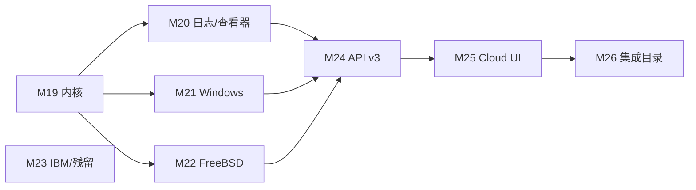

# Monitor 全量移植 Netdata：差距清单与后续计划

> 当前五阶段交付及最新验收见[验收记录](05-acceptance.md)。下方阶段快照保留了本轮早期结果和当时的待办；检查点性能、客户端安全存储、浏览器和macOS打包状态已在新记录中更新。

> 对照 [Netdata](https://github.com/netdata/netdata) Agent + Cloud 全表面。
> **目标：全部搬过来**（图表 ID / 语义对齐；目标不存在则零配置自动禁用）。
> Prometheus / StatsD / OTLP / plugins.d 是**过渡覆盖**，不是终点：能原生采集的都做成 Go 采集器。
> **不要重做 go.d**：`init.go` 除故意跳过的 `testrandom` 外已打勾。

## 0. 现状一句话（M0–M26 已合入 main）

Agent 主路径（采集 → 存 → 告警 → 流 → 查）和 **go.d 应用目录已经对齐**。
计划内批次（M19–M26）均已合入。剩余深度项是 **真 eBPF CO-RE**（可选 CGO build tag）以及文档 §2.7 里明确延后的项。

| 面 | 完成度 | 说明 |
| --- | --- | --- |
| go.d 应用采集器 | **完成** | 除 `testrandom`；约 154 个原生模块 |
| Linux proc / debugfs 常规图 | **完成** | 含 InfiniBand、tc、EDAC、SLAB、zswap、RAPL、DRM、bcache、timex |
| 原生 C 插件便携近似 | **M20 日志/查看器** | journald 跟随、wevtutil XPath/游标、`log show`、network-viewer inode/cmdline、systemd 单位状态；cups / xenstat / ioping / nftables / ipmi / ebpf 仍是 CLI 近似 |
| Windows.plugin | **M21** | 进程/线程/句柄 + Perflib 全家桶（IIS/ASP.NET/.NET/Hyper-V/SMB/NUMA/thermal/AD/Exchange/services 出图）；无角色则跳过 |
| freebsd.plugin | **完成（M22）** | sysctl 全家桶 + ZFS ARC/trim + ipfw + gstat/df/netstat 近似；非 FreeBSD 自动禁用 |
| Hub / Cloud | **产品面（M25）** | claim/Space/Room/OIDC/环复制/LDAP/share + ACLK MQTT-over-WSS + Cloud 控制台 + 图上异常高亮 + Correlations UI |
| 850+ Prometheus 集成名 | **M26 点名包装** | 具名 profile 出原生 ID（etcd/minio/vault/…）；其余仍 `prom.*`；已有采集器的不重复包装 |

注册模块数量以当前构建的 `monitord -list-collectors` 输出为准；注册数量不代表真实端点验收。尚无统一覆盖率分母，不给出 Agent 或集成覆盖百分比。

## 1. 现在有什么（M0–M19 / M22 / M23）

`cpu` `load` `mem` `disk` `diskspace` `net` `uptime` `apps` `systemd` `docker` `nginx` `redis` `apache` `phpfpm` `memcached` `mysql` `postgres` `elasticsearch` `rabbitmq` `proc`（intr/forks/熵/fd/PSI/IPv4+IPv6 SNMP、conntrack、softnet、IPC、mdstat、battery、IPVS、NFS、ZFS、Btrfs、wireless、KSM、zram、InfiniBand、QoS/tc、SCTP、UDP-Lite、synproxy、NUMA、pagetype、IRQ/softirq 明细、EDAC、SLAB、zswap、RAPL、DRM、bcache、timex）`sensors` `netstat` `statsd` `prometheus` `otlp` `httpcheck` `portcheck` `ping` `sslcheck` `dnsquery` `nvidia` `logs` `ml` `haproxy` `lighttpd` `consul` `whoisquery` `mongodb` `pgbouncer` `chrony` `ntpd` `smartctl` `nvme` `apcupsd` `lvm` `zookeeper` `nats` `varnish` `squid` `tomcat` `traefik` `bind` `unbound` `coredns` `hdfs` `postfix` `exim` `dovecot` `fail2ban` `weblog` `squidlog` `openldap` `wireguard` `samba` `freeradius` `tor` `cgroup` `k8s_kubelet` `k8s_kubeproxy` `k8s_apiserver` `k8s_state` `proxysql` `clickhouse` `cockroachdb` `pulsar` `envoy` `upsd` `zfspool` `dmcache` `filecheck` `supervisord` `monit` `snmp` `fluentd` `logstash` `cassandra` `ceph` `couchdb` `couchbase` `hddtemp` `openvpn` `beanstalk` `uwsgi` `powerdns` `dnsmasq` `megacli` `hpssa` `adaptecraid` `redfish` `activemq` `gearman` `geth` `ipfs` `pihole` `powerdns_recursor` `rspamd` `typesense` `storcli` `nginxvts` `tengine` `nsd` `dnsdist` `dnsmasq_dhcp` `isc_dhcpd` `puppet` `openvpn_status_log` `rethinkdb` `yugabytedb` `vernemq` `icecast` `phpdaemon` `pika` `maxscale` `nginxplus` `nginxunit` `docker_engine` `riakkv` `litespeed` `boinc` `spigotmc` `w1sensor` `ap` `dockerhub` `ethtool` `intelgpu` `logind` `dcgm` `panos` `powerstore` `powervault` `s3check` `scaleio` `smbios_memory` `vcsa` `mssql` `oracledb` `sql` `cloudwatch` `azure_monitor` `vsphere` `cato_networks` `snmp_traps` `snmp_topology` `freebsd` `windows` `libvirt` `proxmox` `ebpf` `cups` `xenstat` `ioping` `nftables` `podman` `ipmi` `idlejitter` `perf` `nfacct` `db2` `as400` `mq` `websphere` `pandas` `go_expvar` `am2320` `lxc` `ecs` `containerd` `macos`。

平台骨架已齐：三层 TSDB、Health 表达式、plugins.d、Child→Parent 流、Hub 查询扇出、RBAC、异常顾问（k-sigma / ks2 / volume / k-means）、Graphite/Influx/JSON/Prom remote write/OpenTSDB/Mongo/Kinesis/PubSub/Kafka REST、Webhook/Slack/SMTP/钉钉/企微/飞书/Telegram/Discord/PagerDuty、Vue Dashboard、Flutter Functions、Android logcat。

## 2. 还差什么（M18 之后，按子系统）

原则：下列「近似」不算完成。图表 ID 必须对齐 Netdata；CLI 包装可以先落地，但要在完成标准里写明与 C 插件的语义差。

### 2.1 Linux 内核深度（最高优先级）

| 状态 | Netdata 插件 / 模块 | 我们现在 | 目标 |
| --- | --- | --- | --- |
| 近似 | `ebpf.plugin` | **M19** bpftool 库存 + procfs/kprobe_profile 程序族 | 真 kprobe/CO-RE 仍可选 CGO tag |
| 近似 | `perf.plugin` | **M19** `perf stat` | `PerfEventOpen` 可后续补 |
| 有 | `debugfs` extfrag / audit | **M19** `mem.extfrag.*`；`auditctl -s` → `audit.backlog` | NETLINK_AUDIT 原生 socket |
| 有 | `idlejitter.plugin` | **M19** `system.idlejitter` | — |
| 有 | `nfacct.plugin` | **M19** `nfacct list`；无则保留 nftables | libmnl |
| 有 | `apps.plugin` user/group | **M19** `apps.cpu_user` / `apps.cpu_group` 及 mem/processes | — |
| 近似 | `freeipmi.plugin` | `ipmitool sdr` | 优先 `ipmi-sensors`/`freeipmi`；回退 ipmitool |

### 2.2 日志 / 查看器 / 其它 OS 插件

| 状态 | Netdata | 我们现在 | 目标 |
| --- | --- | --- | --- |
| **M20** | `systemd-journal.plugin` | `journalctl -f`（`follow: false` 关闭）+ `-u`/`-p`/`-b`/`--after-cursor` | 真 sd-journal API 仍可选 |
| **M20** | `windows-events.plugin` | `wevtutil` XPath（游标 / after / before）+ Record Id | 非 Windows 不调用 |
| **M20** | `macos.plugin` / `macos-logs` | `macos.memory_pressure/swap/thermal_level/battery`；`log show --style json` | 非 Darwin 禁用；powermetrics 不默认跑 |
| **M20** | `network-viewer.plugin` | `network-connections` 列含 inode、cmdline；解析失败留空 | inode 来自 `/proc/net/*`，其它 OS inode 为空 |
| **M20** | `systemd-units.plugin` | `systemd.service_units` / `systemd.service_restarts` + Function 状态列 | 无 systemctl 时保留 cgroup 图 |
| 延后 | `profile.plugin` | — | Agent 自身 CPU/锁剖析（可选，默认关） |

### 2.3 Windows.plugin（Perflib 全家桶）

**M21 已有：** `system.cpu_queue`、内核池/swapio、逻辑/物理磁盘、网卡、IIS 站点与应用池、ASP.NET、.NET CLR、Hyper-V、SMB、NUMA、thermal、`cpu.temperature` / `system.hw.sensor.temperature.*`、AD/ADCS/ADFS、Exchange、Terminal Services、`windows.service_state.*` + `windows.services` 汇总、`powersupply.capacity`。数据源：WMI `Win32_PerfFormattedData_*` 主路径（无 CGO PDH）；`typeperf -sc 1` 仅 `typeperf_scan: true` 时启用。对象/角色不存在则跳过。

| 状态 | Perflib / 模块 | 图表族 |
| --- | --- | --- |
| **M21** | processor queue / memory pool / objects / storage / network | `system.cpu_queue` `mem.system_pool_size` `windows.logical_disk.*` `windows.physical_disk.*` `windows.net.*` |
| **M21** | web-service（IIS）、APP_POOL_WAS、asp、netframework | `iis.website_*` `iis.application_pool_*` `aspnet.*` `netframework.clr_*` |
| **M21** | hyperv、smb、thermalzone、numa、terminal-services | `hyperv.vm_cpu` `smb.server_shares_*` `system.thermalzone_temperature` `mem.numa_node_mem_usage` `windows.terminal_services.sessions` |
| **M21** | ad / adcs / adfs / exchange | 角色存在时自动启用 |
| **M21** | GetServicesStatus 出图、GetPowerSupply、GetSensors、GetHardwareInfo | `windows.service_state.*` `windows.power.charge` `powersupply.capacity` `cpu.temperature` `system.hw.sensor.temperature.*` |

### 2.4 freebsd.plugin（M22 已合入）

M16 骨架 + M22 剩余：sysctl（syscalls / pgfaults / swapio / RAM 明细 / available / active_processes / cpu freq / hw.intrcnt / net.isr / net.inet* / inet6）、`kstat.zfs` ARC + zio trim、`ipfw -a list`、`gstat`/`df`/`netstat` 近似 devstat / getmntinfo / getifaddrs。

与 C 插件的语义差：`net.inet.tcp.stats` 等内核结构体无 CGO 不解码，fixture / 点分 sysctl 键才出 TCP 明细；gstat `-b` 在无累计计数时按速率行映射。gopsutil 已占用的 `disk.*` / `disk_space.*` / `net.*` ID 不再重复建图。

### 2.5 IBM / python.d 残留 / 容器专用

| 状态 | 模块 | 说明 |
| --- | --- | --- |
| **M23** | ibm.d `db2` / `as400` / `mq` / `websphere` | 合入：CLI/HTTP 便携实现；图表 ID 对齐 `mq.queue.depth`/`mq.qmgr.status`、`db2.bufferpool_hit_ratio`/`db2.log_space`、`as400.memory_pool_usage`。真 ODBC CGO 仍可选后续 |
| **M23** | python.d `pandas` / `go_expvar` / `am2320` | pandas 抓 JSON/CSV 首行（**不** eval Python）；go_expvar `/debug/vars`；am2320 sysfs |
| **M23** | 容器运行时 | Docker / Podman / 通用 cgroup / k8s 之外：`lxc`、`ecs`、`containerd` |
| 近似 | Kafka | 导出走 Kafka REST；采集可走 prometheus。原生 broker 协议仅在需要原生 ID 时做 |

### 2.6 API / 查询 / ML / Dashboard

| 状态 | 能力 |
| --- | --- |
| 有 | v1 全套常用端点；v2 contexts/nodes/data/q/badge；`group_by=node`；alert_transitions；manage/health |
| **M24** | `/api/v3` 子集（info/data/q/contexts/context/nodes/weights/alerts/alert_transitions/alert_config/functions/badge/allmetrics）；`group_by=dimension` 与 `group_by=node,dimension`；`alert_config` CRUD；`options=anomaly-bit` 与 `dimension_anomaly`（0–100）兼 `anomaly`（0/1）；Vue 图上 ANOM 高亮 |
| **有（M25）** | Metric Correlations 完整 UI（group/top/窗口/分数条/点选筛选）；ACLK MQTT 3.1.1 over WSS；Cloud 控制台 |
| **有（M26）** | `GET /api/v1/prometheus/catalog`；prometheus job `profile`/`fallback` |

### 2.7 明确不做 / 延后

| 项 | 策略 |
| --- | --- |
| go.d 已实现模块 | **不再移植** |
| `testrandom` | 永远跳过 |
| 850+ Prometheus 集成名 | **M26** 点名 profile 已出原生 ID；其余继续 `prom.*`，不要逐个手写 |
| charts.d bash 编排器 | 已有 plugins.d；不内嵌 bash 解释器 |
| 真 CGO eBPF CO-RE | 后续可选 `cilium/ebpf-go` build tag；默认静态二进制仍无 CGO |
| Netdata Cloud SaaS 账号体系 | 用自建 Hub 对等，不对接 netdata.cloud 账号 |

## 3. 分批计划

原则不变：每批可合并、可测、图表 ID 对齐、目标缺失即禁用。完成标准一律 `go test -race`、`vue-tsc`、`scripts/smoke.sh`。

### 3.1 已完成（M7–M19、M22、M23、M26）

| 批次 | 搬什么 | 状态 |
| --- | --- | --- |
| **M7** | proc 五件套；haproxy/lighttpd/consul/whoisquery；contexts/silence/variables；OpenTSDB；Telegram/Discord/PagerDuty | 合入 |
| **M8** | ipv6/ipvs/nfs/zfs/btrfs/wireless/ksm/zram；mongodb/pgbouncer/chrony/ntpd/smartctl/nvme/apcupsd/lvm | 合入 |
| **M9** | zookeeper/nats/varnish/squid/tomcat/traefik/bind/unbound/coredns/hdfs | 合入 |
| **M10** | postfix/exim/dovecot/fail2ban/weblog/squidlog/openldap/wireguard/samba/freeradius/tor | 合入 |
| **M11** | cgroup + k8s_kubelet/kubeproxy/k8s_state/k8s_apiserver | 合入 |
| **M12 … 续 6** | go.d init.go 收尾（跳过 testrandom） | 合入 |
| **M13** | 系统 health.d；data context；csv/ssv/jsonp；v2 子集；badge | 合入 |
| **M14** | Hub claim/Space/Room/OIDC/配置下发/环复制 | 合入 |
| **M15** | k-means ML、Functions、Mongo 导出 | 合入 |
| **M16** | Windows/FreeBSD 骨架、Flutter Functions、Android logcat | 合入 |
| **M17** | proc 剩余 + libvirt/proxmox/ebpf 近似；manage/health；维护窗口；Kinesis/Pub/Sub；LDAP/share | 合入 |
| **M18** | EDAC/SLAB/zswap/RAPL/DRM/bcache/timex；cups/xenstat/ioping/nftables/podman/ipmi；Kafka REST；v2/q | 合入 |
| **M19** | eBPF 程序族、perf、extfrag/audit、idlejitter、apps user/group、nfacct | 合入 |
| **M20** | journald 跟随、Windows Events 分页、macos、network-viewer、systemd 单位状态 | 合入 |
| **M22** | freebsd.plugin 剩余：sysctl/ZFS ARC/ipfw/net.inet*/gstat/df | 合入 |
| **M23** | ibm.d db2/as400/mq/websphere；pandas/go_expvar/am2320；lxc/ecs/containerd | 合入 |
| **M26** | Prometheus 点名 profile 原生 ID + `/api/v1/prometheus/catalog` | 合入 |
| **M21（合入）** | Windows Perflib：WMI 主路径 + IIS 应用池/传感器/硬件温度 | `go test -race`、Windows CI fixture |

### 3.2 后续批次（M19–M26）

| 批次 | 搬什么 | 为什么现在做 | 完成标准（额外） |
| --- | --- | --- | --- |
| **M19（合入）** | eBPF 程序族、perf、extfrag/audit、idlejitter、apps user/group、nfacct | Linux 与 Netdata 差异最大的一块 | fixture + smoke `system.idlejitter` |
| **M20 日志与查看器（合入）** | journald 跟随流；Windows Events 分页；macos.plugin + macos-logs；network-viewer；systemd-units 出图 | Functions/日志是排障主路径 | fixture；`GOOS=darwin go test -c`；smoke `logs` / `network-connections` |
| **M21 Windows.plugin（合入）** | Perflib 全家桶（见 §2.3 / §4.5） | 与 M19/M20 并行 | WMI/typeperf fixture；无角色则跳过 |
| **M22 freebsd.plugin（合入）** | ZFS ARC、ipfw、net.inet*、devstat、getmntinfo、getifaddrs、swap/RAM/pgfaults | FreeBSD 骨架太薄 | sysctl fixture + `GOOS=freebsd` 交叉编译 |
| **M23 IBM 与残留应用（合入）** | ibm.d db2/as400/mq/websphere（CLI/HTTP，无 CGO）；pandas/go_expvar/am2320；lxc/ecs/containerd | 长尾，不挡主路径 | 图表 ID 对齐 `mq.queue.depth` / `db2.bufferpool_hit_ratio` / `as400.memory_pool_usage`；无驱动禁用 |
| **M24 查询 API 深度（合入）** | `/api/v3` 子集；`group_by=dimension`；`alert_config` CRUD；每维 anomaly 写入 data 响应 | Cloud UI 和关联分析的前置 | API 单测 + smoke 新路径 |
| **M25 Hub Cloud 产品（合入）** | 真 ACLK（MQTT over WSS）；Cloud 控制台；告警路由可视化；图上异常高亮；完整 Correlations UI | 产品面对齐，不是再堆采集器 | Hub 双节点冒烟；Vue 面板 |
| **M26 集成目录（合入）** | 仅为**点名需要原生 ID** 的 Prometheus 集成做包装；目录文档化「prom.* vs 原生」 | 850+ 名不值得逐个手写 | `GET /api/v1/prometheus/catalog`；fixture 抓取 |

### 3.3 批次依赖

M21 / M22 / M23 互不阻塞，可并行开 PR。M24 依赖前面采集面稳定后再动查询协议。M25 依赖 M24。M23 可随时插空。

## 4. 本轮之后

M19–M26 计划批次已全部合入。后续可选深度见 §2.7（真 eBPF CO-RE、profile.plugin、Kafka 原生协议等），不再按 MNN 强制排期。

## 4.0 M20（已合入 main）

1. journald：`journalctl -f` 跟随（`follow: false` 退回按次查询）；Function 支持 `unit` / `priority` / `boot` / `cursor`
2. Windows Events：`wevtutil /q` XPath，游标为 EventRecordID，after/before 写入 TimeCreated；非 Windows 不执行
3. macOS：`macos.memory_pressure`、`macos.swap`、`macos.thermal_level`、`macos.battery`（sysctl / memory_pressure / pmset）；统一日志 `source=macos` 走 `log show`；非 Darwin 自动禁用
4. network-viewer：`network-connections` 增加 `cmdline` 与 `inode`（`/proc/net/tcp*`）；进程或 inode 解析失败则该列为空
5. systemd-units：`systemctl show` → `systemd.service_units`、`systemd.service_restarts`；Function `services` 增加 active_state / nrestarts；无 systemctl 时保留 cgroup 图
6. health.d `system_m20.yaml`：`systemd_units_failed`

## 4.0b M24（已合入 main）

1. `/api/v3` 子集：info / data / q / contexts / context / nodes / weights / alerts / alert_transitions / alert_config / functions / function / badge.svg / allmetrics；payload `api: 3`
2. `group_by=dimension`（同 context 下按维度 ID 合并实例）；`group_by=node,dimension`（列名为 `node.dim`）
3. `GET|PUT|POST|DELETE /api/v3/alert_config`（及 v1 别名）：YAML 或 JSON 规则 CRUD，`hash` 查询
4. 每维 anomaly：ML 保存 0/100 bit 环；`data` 响应 `dimension_anomaly`（0–100）与 `anomaly`（0/1）；`options=anomaly-bit` 把数值换成 0–100；health lookup 支持 `anomaly-bit`；Vue 异常维度标红 + ANOM 徽标

## 4.2 M19（已合入 main）

1. eBPF 程序族：`ebpf.cachestat/dcstat/fd/vfs/oomkill/process/shm/swap/disk/mount/hardirq`（kprobe_profile 优先，否则 `/proc` 近似）；bpftool 库存图保留；无源则禁用子图
2. `perf`：`perf stat -a -x,` → `perf.cpu` / `perf.instructions` / `perf.cache_misses`；无权限禁用
3. debugfs：NUMA `mem.extfrag.*`、`audit.backlog`（`auditctl -s`）
4. `idlejitter` → `system.idlejitter`
5. apps：`apps.cpu_user` / `apps.cpu_group` / `apps.mem_*` / `apps.processes_*`
6. `nfacct`：`netfilter.nfacct_packets/bytes.{name}`
7. health.d `system_m19.yaml`

## 4.3 M22（已合入 main）

freebsd.plugin 剩余，不碰 go.d。

1. **sysctl 扩展**：`system.syscalls` `mem.pgfaults` `mem.swapio` `system.ram` 明细 `mem.available` `system.active_processes` `cpu.scaling_cur_freq` `system.interrupts` `system.softnet_stat`
2. **net.inet***：`ipv4.tcpsock/tcppackets/tcperrors/tcphandshake`、UDP/ICMP/IP、`ipv6.packets/errors/icmp`（点分键；opaque 结构体不解码）
3. **ZFS**：复用 `zfs.arc_size` 等 + `zfs.l2_size/bytes/memory_ops/important_ops/arc_size_breakdown/trim_*`
4. **ipfw**：`ipfw.mem/packets/bytes/active/expired`（`ipfw -a list`）
5. **devstat / mnt / if**：`gstat` / `df -kP` / `netstat -ibn`，已有同 ID 则跳过
6. **health.d** `system_m22.yaml`：`zfs_memory_throttle` / `freebsd_ipfw_drops` / `freebsd_softnet_drops`
7. **测试**：sysctl+ipfw+gstat+df+netstat fixture 两拍；`GOOS=freebsd go test -c`

## 4.4 M23（已合入 main）

ibm.d / python.d 残留 / 专用容器运行时。默认无 CGO；Init 失败即禁用。图表 ID 对齐 Netdata：

1. `db2` / `as400` / `mq` / `websphere`：ibm.d 图表 ID 子集
   - db2：`db2.connections` / `db2.locking` / `db2.deadlocks` / `db2.log_utilization`（dim `utilization`）/ `db2.log_space` / `db2.bufferpool_hit_ratio` / `db2.service_health`
   - as400：cpu/jobs/ASP + `as400.memory_pool_usage` / `as400.temporary_storage`
   - mq：`mq.qmgr.status`、`mq.queues.overview`、`mq.queue.depth`（dims `current`/`max`）、`mq.queue.depth_percentage`、`mq.queue.messages`、`mq.queue.connections`（`dspmq`/`runmqsc`，无 CGO PCF）
   - websphere：JVM heap/threads/sessions；JSON 与 Prometheus 文本
2. `pandas` JSON/CSV 首行（dimension 按 key 排序）；`go_expvar` memstats；`am2320` sysfs
3. `lxc` / `ecs` / `containerd` 状态图 + Functions `lxc-containers` / `ecs-containers` / `containerd-containers`
4. health.d `system_m23.yaml`（`mq.queue.depth` of `current`）

## 4.4 M26（已合入 main）

点名 Prometheus 包装，不扩 go.d、不重做已有原生采集器。

1. `prometheus` 采集器 `profiles: auto|off` + job `profile` / `fallback`
2. 内置 profile：etcd、minio、vault、jenkins、grafana、prometheus、alertmanager、kafka、blackbox、gitlab、harbor、argocd、cert_manager、cilium、istio、vllm、litellm；显式：fastapi、go_runtime、python_gc
3. 未匹配族仍为 `prom.*`；`GET /api/v1/prometheus/catalog` 列出 profile / dedicated / fallback
4. health.d `system_m26.yaml`（etcd 无 leader、Vault sealed、MinIO、blackbox、Kafka brokers、Alertmanager、Jenkins 队列）
5. 目录见本节与 catalog API；850+ 其余集成不手写

## 4.5 M21（已合入 main）

Windows.plugin Perflib 全家桶，不碰 go.d，不扩 eBPF/FreeBSD。

1. WMI `Win32_PerfFormattedData_*` 为直播路径（无 CGO PDH）；缺失类写入 skip map，后续 Collect 不再查。`typeperf -sc 1` 仅 `typeperf_scan: true` 时按对象通配查询
2. 核心 OS（System/Memory/Objects/Processor/LogicalDisk/PhysicalDisk/Network）+ 可选角色（IIS/ASP.NET/.NET/Hyper-V/SMB/NTDS/…）+ `Win32_Battery` / `MSAcpi_ThermalZoneTemperature` / `Win32_TemperatureProbe`
3. 图表：CPU 队列、内核池、逻辑/物理磁盘、网卡、IIS 站点与应用池、ASP.NET、.NET CLR、Hyper-V、SMB、NUMA、thermal、`cpu.temperature`、传感器 histogram、AD/ADCS/ADFS、Exchange、RDS、`powersupply.capacity`
4. `sc query` → `windows.service_state.{name}` + 汇总 `windows.services`
5. health.d `system_m21.yaml`

## 4.6 M25（已合入 main）

Hub Cloud 产品面。不碰 go.d。

1. **ACLK MQTT-over-WSS**：`/api/v1/aclk` MQTT 3.1.1，payload 仍是 JSON `stream.Frame`；JSON `/api/v1/stream` 默认；`stream.protocol: mqtt|aclk`
2. **Cloud 控制台**：`GET /api/v1/hub/console` + Vue `CloudPanel`
3. **图上异常高亮**：`charts`/`chart` 每维 `anomaly`；`/data` 同时返回 `anomaly`（0/1）与 `dimension_anomaly`（0–100）
4. **完整 Correlations UI**：`weights?method=ks2|volume&group=&top=`

每完成一批，把本节的「未做」改成「有」，不要另开平行文档。

## 6. 工程约束（各批通用）

- 图表 ID / context / 单位 / algorithm（absolute vs incremental）对齐 Netdata。
- Init 失败进入后台退避重试，不影响其它模块；手动禁用不重试。
- 默认静态二进制、无 CGO；需要 CGO 的能力用 build tag，CI 主矩阵仍 `CGO_ENABLED=0`。
- 不跑全量 Maven；Go 变更用已有 `go test` / 单测类，前端 `vue-tsc`。
- 新 API 必须进 `scripts/smoke.sh`。
- Windows 路径禁止 `:` 等非法字符（RAPL 已踩过）。
- Health 锁不可重入；通知计数先 `markNotified` 再 `Add`。
- 分支名 `cursor/netdata-mNN-<topic>-8c7b`，PR 对 `main`。

## 6. 稳定性阶段验收（2026-09-22）

| 能力 | 实现及依赖 | 自动验证 | 真实环境 / 待完成 |
| --- | --- | --- | --- |
| OIDC | 标准 go-oidc 验证签名/issuer/audience/expiry，nonce、PKCE、浏览器 state，限时会话及 logout；OIDC 单独配置时禁止匿名管理员 | 签名模拟 IdP 正反例、越权/过期/退出 | 外部 IdP 联调待验收 |
| HTTPS 采集 | 13 个曾共用 insecureClient 的模块（含合并后的 Proxmox）默认校验证书；tls.ca_file、tls.insecure_skip_verify | 本地 TLS 服务：不可信拒绝、CA 信任成功、显式不安全成功 | K8s / BMC / 存储真实设备待验收 |
| MSSQL | 依赖 sqlcmd；命中率使用 numerator/base，缺失计数不写零 | 比例/缺失/零分母回归 | SQL Server 实机待验收 |
| 采集器恢复 | 初始化失败 5 秒至 60 秒退避后台重试；手动禁用不重探；重新启用先初始化 | 离线恢复、并发启停 race 回归 | 长时间运行待验收 |
| Web / Agent / Hub | Go >=1.25，CI 固定1.27.1；Node 24.19.0 | make all、make test（含 race/vet）、scripts/smoke.sh 通过 | 本轮 macOS amd64；其他平台以 CI 结果为准 |
| 历史/持久化/HA | 三层 TSDB、Agent 补传已有；现有 Hub ring 仅最后样本 | 现有单测通过 | 阶段3继续；不得称为完整 HA |
| Flutter / Android | 客户端、Kotlin 服务壳已有 | 本轮未执行移动端构建 | 安全存储、后台恢复、真机验收继续 |

CI 与 Release 使用同一 Go/Node 版本；开发机不再依赖 PATH 中的旧 Node 18。
TLS 行为变更：自签名端点应配置私有 CA，不再静默接受任意证书。

## 7. 阶段3：持久化、备份和历史复制

- TSDB 检查点默认 30s；块内容同步后原子替换，Unix 同步所在目录；Windows 目录同步由系统管理。
- `/api/v1/info` 的 `db.persistence` 报告最后成功检查点的开始/完成时间及错误。**30s 是调度间隔，不是硬性丢失上限**：异常退出可能丢失上次成功检查点之后的数据；尚未实现逐样本 WAL 或跨层事务。
- 检查点最多8个并发写任务，不阻塞正常采样；写块期间保留可查询的缓冲区，避免瞬时数据空洞。未结束的 rollup bucket 也进入检查点。
- `monitord -config monitor.yaml -data-dir ./data -backup-dir /path/new-backup`：停服备份，SHA-256 清单，拒绝正在使用的数据目录。
- `monitord -config monitor.yaml -data-dir /path/new-data -restore-from /path/new-backup`：校验后恢复，只允许新目录；失败留下的目录不应启动使用，应检查原因并换一个新目录重试。备份包含监控数据和可能的 Hub 凭证，应限制访问。
- Hub ring 改成每图每次最多4页、每页5分钟原始分辨率历史；仅HTTP成功后推进进度，保留60s重叠；速率不再二次计算，副本身份跨重启保留。
- **HA边界**：还不是共识集群或任意故障零丢失；60s重叠不能覆盖任意慢检查点或副本盘丢失。完整重建可重启源Hub重新回放尚在保留期内的历史；超8MiB单页会记录错误而不会错误推进游标。
- 验证：备份占用/损坏/覆盖保护，检查点后异常退出的 raw/rollup 恢复，查询与检查点并发，Hub历史补传及拒绝重试，进程级 SIGKILL 与备份恢复比对。复现：`make verify-durability`。

## 8. 阶段4：日常使用与客户端恢复

- Dashboard：6小时/24小时/7天窗口，每图最多1200历史点；长窗口每30秒重新降采样，不累积逐秒数组；异步查询过期响应丢弃，卸载后不再更新图表。
- 节点健康卡片显示在线/过期/离线、最后数据和严重告警；图表区分暂无数据与过期；采集器悬停显示失败原因；存储落盘失败直接显示。
- Flutter：移除旧版 SharedPreferences 中的明文 token，凭证仅保留本次运行，连接表单明确提示重启后重新输入；WebSocket 使用编码子协议，URL 不再携带 token。平台安全存储和推送仍待后续真实设备验收。
- Android：子进程崩溃 1s→60s 重启退避，稳定运行一分钟后重置；手动停止取消重试；Android 15 dataSync 超时主动停止，启动限制不再冒充永久保活。
- Android 15+ 不从 BOOT_COMPLETED 启动 dataSync：需要打开应用启动。依据：https://developer.android.com/about/versions/15/behavior-changes-15 。仍需真机验证后台耗电和系统回收行为。
- 验证：Vue生产构建通过，Flutter analyze与6项单测通过。浏览器控制工具超时，UI目视验收未完成；Android服务端调试APK构建通过；Flutter macOS完整打包因缺少CocoaPods未通过，不能将代码检查等同于真机通过。

## 9. 阶段5：可复现的容量与运行基线

- `monitord -list-collectors` 输出编译进二进制的模块名；它只说明注册，不说明依赖满足或真实设备验证通过。
- `make bench`：2000条序列的内存追加、24小时历史读取并聚合到600点、2000条序列的同步检查点分别测量；明确区分追加耗时和持久化耗时。
- `make soak`：隔离数据和临时端口，连续120秒采集 cpu/mem/load/disk/net，记录API延迟、RSS、磁盘量与采集错误；出错返回非零。
- CI（Linux/macOS）加入独立进程的强杀恢复、运行中备份拒绝及备份恢复比对；Go/Flutter现有检查保留。
- 本机基线（Intel i7-9750H，macOS amd64）：120秒、74张图表、60次请求，查询中位数3.05ms，最大186.61ms，最大RSS18.27MiB，最终磁盘266000字节，采集/请求/关闭错误0。
- 微基准：2000序列追加498ns/sample（**不包含持久化**），24小时读取+600点聚合674377ns/query（约0.67ms）。同时存在其他构建负载，结果不是独占主机峰值。
- 持久化微基准：2000条序列首次同步检查点耗时249.66秒（本机并行构建期间）。当前每序列文件同步仍是明显瓶颈，不适合据此承诺大规模写入或30秒持久化上限；下一步优先评估WAL与合并块。
- 尚不能宣称：1000节点/200万samples每秒、72小时稳定、Hub无感切换、全部采集器真实可用。下一批应测独立Linux Hub的10→100→1000节点阶梯负载、磁盘耗尽、网络分区和长时间保留清理；以实测决定是否引入WAL和合并块存储。

## 10. 与远端 M17–M23 合并验收

- 保留新增采集器、告警维护、Contexts、LDAP/share 与 FreeBSD 功能；Proxmox 采用统一的默认证书校验及私有CA配置。
- LDAP单独配置时拒绝匿名管理员；空LDAP配置不改变本地开放模式；登录角色校验、会话退出撤销和LDAPS证书验证均有回归测试。`ldap://`仍是明文协议，部署时应使用可信证书的`ldaps://`。
- 合并后 Go vet、全量race测试、Vue构建/typecheck、API/Hub冒烟、独立进程强杀及备份恢复通过。编译进二进制的模块为174个，不能据此推导真实设备覆盖率。
- 备份恢复核对4行固定时刻RAM数据完全一致；运行中备份被正确拒绝。性能数字来自上述本机基线，并非新增加的全部采集器负载测量。

### 构建产物复核

- `make cross`通过8个目标：Linux amd64/arm64、macOS amd64/arm64、Windows amd64、FreeBSD amd64/arm64、Android arm64。交叉编译不等同于目标机器运行验收。
- Android服务端`app-debug.apk`：版本`3fc5046`、包名`dev.monitor.server`、minSdk26、targetSdk35；APK v2签名通过，解包后的Go程序与本次编译文件逐字节一致。
- APK SHA-256：`94f916a040e8f15832021346425789e871f880fd40c10bfd6c6a0ecf374a297d`。未执行手机安装或后台实机验收。
- 远端`main`在验收期间继续新增M19/M26等提交，本轮已验证成果交付到`codex/reliability-stages-3-5`。这些后续远端改动不在上述验收范围；合并前需再次集成测试。
