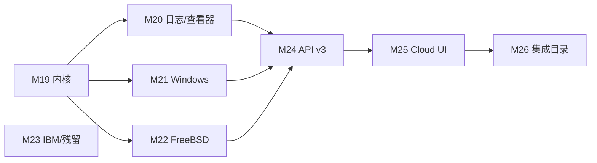

# Monitor 全量移植 Netdata：差距清单与后续计划

> 对照 [Netdata](https://github.com/netdata/netdata) Agent + Cloud 全表面。
> **目标：全部搬过来**（图表 ID / 语义对齐；目标不存在则零配置自动禁用）。
> Prometheus / StatsD / OTLP / plugins.d 是**过渡覆盖**，不是终点：能原生采集的都做成 Go 采集器。
> **不要重做 go.d**：`init.go` 除故意跳过的 `testrandom` 外已打勾。

## 0. 现状一句话（M0–M18 已合入 main）

Agent 主路径（采集 → 存 → 告警 → 流 → 查）和 **go.d 应用目录已经对齐**。
剩下主要是 **eBPF/perf 内核探针、Windows/FreeBSD 深度、IBM、Cloud 产品面**。

| 面 | 完成度 | 说明 |
| --- | --- | --- |
| go.d 应用采集器 | **完成** | 除 `testrandom`；约 154 个原生模块 |
| Linux proc / debugfs 常规图 | **完成** | 含 InfiniBand、tc、EDAC、SLAB、zswap、RAPL、DRM、bcache、timex |
| 原生 C 插件便携近似 | **骨架完成** | cups / xenstat / ioping / nftables / ipmi / ebpf(bpftool) / journalctl / wevtutil |
| Windows.plugin | **骨架** | 进程/线程/句柄 + Function `windows-services`；缺 Perflib 全家桶 |
| freebsd.plugin | **骨架** | ctxt/intr/softirq/forks/wired/laundry/IPC/温度；缺 ZFS/ipfw/net.inet*/devstat |
| Hub / Cloud | **骨架** | claim/Space/Room/OIDC/环复制/LDAP/share；缺真 ACLK MQTT 与 Cloud 控制台 |
| 850+ Prometheus 集成名 | **M26 点名包装** | 具名 profile 出原生 ID（etcd/minio/vault/…）；其余仍 `prom.*`；已有采集器的不重复包装 |

约 **165** 个内置采集器。Netdata 公开目录约 **850+ 集成名**（多数是 Prometheus 抓取别名）。Monitor 原生覆盖大约 **18%** 的集成名、**核心 Agent 路径约 80%**（采集→存→告警→流→查）。深度缺口集中在内核探针与平台插件。

## 1. 现在有什么（M0–M18）

`cpu` `load` `mem` `disk` `diskspace` `net` `uptime` `apps` `systemd` `docker` `nginx` `redis` `apache` `phpfpm` `memcached` `mysql` `postgres` `elasticsearch` `rabbitmq` `proc`（intr/forks/熵/fd/PSI/IPv4+IPv6 SNMP、conntrack、softnet、IPC、mdstat、battery、IPVS、NFS、ZFS、Btrfs、wireless、KSM、zram、InfiniBand、QoS/tc、SCTP、UDP-Lite、synproxy、NUMA、pagetype、IRQ/softirq 明细、EDAC、SLAB、zswap、RAPL、DRM、bcache、timex）`sensors` `netstat` `statsd` `prometheus` `otlp` `httpcheck` `portcheck` `ping` `sslcheck` `dnsquery` `nvidia` `logs` `ml` `haproxy` `lighttpd` `consul` `whoisquery` `mongodb` `pgbouncer` `chrony` `ntpd` `smartctl` `nvme` `apcupsd` `lvm` `zookeeper` `nats` `varnish` `squid` `tomcat` `traefik` `bind` `unbound` `coredns` `hdfs` `postfix` `exim` `dovecot` `fail2ban` `weblog` `squidlog` `openldap` `wireguard` `samba` `freeradius` `tor` `cgroup` `k8s_kubelet` `k8s_kubeproxy` `k8s_apiserver` `k8s_state` `proxysql` `clickhouse` `cockroachdb` `pulsar` `envoy` `upsd` `zfspool` `dmcache` `filecheck` `supervisord` `monit` `snmp` `fluentd` `logstash` `cassandra` `ceph` `couchdb` `couchbase` `hddtemp` `openvpn` `beanstalk` `uwsgi` `powerdns` `dnsmasq` `megacli` `hpssa` `adaptecraid` `redfish` `activemq` `gearman` `geth` `ipfs` `pihole` `powerdns_recursor` `rspamd` `typesense` `storcli` `nginxvts` `tengine` `nsd` `dnsdist` `dnsmasq_dhcp` `isc_dhcpd` `puppet` `openvpn_status_log` `rethinkdb` `yugabytedb` `vernemq` `icecast` `phpdaemon` `pika` `maxscale` `nginxplus` `nginxunit` `docker_engine` `riakkv` `litespeed` `boinc` `spigotmc` `w1sensor` `ap` `dockerhub` `ethtool` `intelgpu` `logind` `dcgm` `panos` `powerstore` `powervault` `s3check` `scaleio` `smbios_memory` `vcsa` `mssql` `oracledb` `sql` `cloudwatch` `azure_monitor` `vsphere` `cato_networks` `snmp_traps` `snmp_topology` `freebsd` `windows` `libvirt` `proxmox` `ebpf` `cups` `xenstat` `ioping` `nftables` `podman` `ipmi`。

平台骨架已齐：三层 TSDB、Health 表达式、plugins.d、Child→Parent 流、Hub 查询扇出、RBAC、异常顾问（k-sigma / ks2 / volume / k-means）、Graphite/Influx/JSON/Prom remote write/OpenTSDB/Mongo/Kinesis/PubSub/Kafka REST、Webhook/Slack/SMTP/钉钉/企微/飞书/Telegram/Discord/PagerDuty、Vue Dashboard、Flutter Functions、Android logcat。

## 2. 还差什么（M18 之后，按子系统）

原则：下列「近似」不算完成。图表 ID 必须对齐 Netdata；CLI 包装可以先落地，但要在完成标准里写明与 C 插件的语义差。

### 2.1 Linux 内核深度（最高优先级）

| 状态 | Netdata 插件 / 模块 | 我们现在 | 目标 |
| --- | --- | --- | --- |
| 近似 | `ebpf.plugin` | `bpftool prog show` → 程序数/memlock/run_time | 真探针：cachestat / dcstat / disk / fd / filesystem / hardirq / oomkill / process / socket / vfs / mdflush / mount / shm / swap / sync；与 apps / cgroup 关联 |
| 无 | `perf.plugin` | — | PMU：`perf_event_open` 或 `perf stat` → `perf.cpu.*` / `perf.hw.*` |
| 部分 | `debugfs.plugin` | zswap / RAPL / sensors 已有 | 补 **NUMA extfrag**、**audit**（`/sys/kernel/debug/extfrag`、audit backlog） |
| 近似 | `nfacct.plugin` | `nft list counters` | netfilter acct（nfacct / conntrack 字节会计）；无 nfacct 时保留 nft |
| 近似 | `freeipmi.plugin` | `ipmitool sdr` | 优先 `ipmi-sensors`/`freeipmi`；回退 ipmitool |
| 无 | `idlejitter.plugin` | — | 用户态 idle 抖动 microseconds |
| 部分 | `apps.plugin` | 按进程组 cpu/mem/io | 补 **user / user group** 分解图 |

### 2.2 日志 / 查看器 / 其它 OS 插件

| 状态 | Netdata | 我们现在 | 目标 |
| --- | --- | --- | --- |
| 近似 | `systemd-journal.plugin` | `journalctl` 一次性查询 | 跟随流、字段过滤、boot/unit/priority、Function 对齐 |
| 近似 | `windows-events.plugin` | `wevtutil` + `channel=` | ETW/Evtx 分页、XPath、Function 对齐 |
| 无 | `macos.plugin` / `macos-logs.plugin` | gopsutil 通用 cpu/mem/disk | mach host_info、powermetrics 可选、统一日志 `log show` |
| 无 | `network-viewer.plugin` | Function `network-connections` | 连接×进程实时表（inode→pid），与 Netdata Function 列对齐 |
| 部分 | `systemd-units.plugin` | systemd cgroup cpu/mem/io | 单位状态/失败/重启计数图 + Function |
| 无 | `profile.plugin` | — | Agent 自身 CPU/锁剖析（可选，默认关） |

### 2.3 Windows.plugin（Perflib 全家桶）

M16 只有 `system.processes/threads/handles/ctxt` + Function `windows-services`。Netdata `windows.plugin` 还缺：

| 批次优先级 | Perflib / 模块 | 图表族（对齐 Netdata ID） |
| --- | --- | --- |
| 高 | processor / memory / objects / processes / storage / network | CPU 队列、内存池、磁盘物理/逻辑、网卡 |
| 高 | web-service（IIS）、asp、netframework | IIS 请求/队列、ASP.NET、.NET CLR |
| 中 | hyperv、smb、thermalzone、numa、terminal-services | Hyper-V VM、SMB、温度、NUMA、RDS |
| 低 | ad / adcs / adfs / exchange | 仅当角色存在时自动启用 |
| 中 | GetServicesStatus **出图**（不仅 Function）、GetSensors、GetPowerSupply、GetHardwareInfo | `windows.service.*`、传感器、电源、硬件清单 |

无 CGO PDH 时走 WMI `Win32_PerfRawData_*` / `typeperf`；Init 失败即禁用。

### 2.4 freebsd.plugin 剩余

M16 有 ctxt/intr/softirq/forks/wired/laundry/IPC/cpu.temperature。对照 `plugin_freebsd.h` 还缺：

| 模块 | 数据源 |
| --- | --- |
| loadavg / vmtotal / kern.cp_time / cp_times / cpu freq | sysctl |
| hw.intcnt、syscalls、swap、RAM 明细、swappgs、pgfaults | sysctl |
| net.isr、net.inet.tcp/udp/icmp/ip、inet6 | sysctl |
| getifaddrs、getmntinfo、kern.devstat | 系统调用 / sysctl |
| kstat ZFS ARC + zio trim | sysctl `kstat.zfs` |
| ipfw | `ipfw show` 或 sysctl |

非 FreeBSD 自动禁用；Linux CI 用 fixture 解析 + `GOOS=freebsd` 交叉编译。

### 2.5 IBM / python.d 残留 / 容器专用

| 状态 | 模块 | 说明 |
| --- | --- | --- |
| 无 | ibm.d `db2` / `as400` / `mq` / `websphere` | Netdata 因 CGO 从 go.d 拆出；默认 `//go:build cgo` 或 CLI 包装，无驱动则禁用 |
| 无 | python.d `pandas` / `go_expvar` / `am2320` | pandas 需配置脚本；go_expvar 抓 `/debug/vars`；am2320 I2C |
| 部分 | 容器运行时 | 有 Docker / Podman / 通用 cgroup / k8s；缺 **LXC / ECS / containerd** 专用图 |
| 近似 | Kafka | 导出走 Kafka REST；采集可走 prometheus。原生 broker 协议仅在需要原生 ID 时做 |

### 2.6 API / 查询 / ML / Dashboard

| 状态 | 能力 |
| --- | --- |
| 有 | v1 全套常用端点；v2 contexts/nodes/data/q/badge；`group_by=node`；alert_transitions；manage/health |
| **M26** | `GET /api/v1/prometheus/catalog`；prometheus job `profile`/`fallback` |
| **未做** | `/api/v3`；`group_by=dimension`；`alert_config`（单条规则 CRUD）；chart 异常高亮（每维 anomaly bit） |
| **未做** | Metric Correlations 完整 UI（现在只有 Weights 面板窗口输入） |
| 近似 | `info.aclk` 语义字段；流仍是 WebSocket，**不是 MQTT over WSS** |
| **未做** | Cloud 控制台产品面（节点清单/房间拓扑/告警路由可视化，不只 API） |

### 2.7 明确不做 / 延后

| 项 | 策略 |
| --- | --- |
| go.d 已实现模块 | **不再移植** |
| `testrandom` | 永远跳过 |
| 850+ Prometheus 集成名 | **M26** 点名 profile 已出原生 ID；其余继续 `prom.*`，不要逐个手写 |
| charts.d bash 编排器 | 已有 plugins.d；不内嵌 bash 解释器 |
| 真 CGO eBPF CO-RE | M19 先 `cilium/ebpf-go` **可选 tag** + bpftool/tracefs 回退；默认静态二进制仍无 CGO |
| Netdata Cloud SaaS 账号体系 | 用自建 Hub 对等，不对接 netdata.cloud 账号 |

## 3. 分批计划

原则不变：每批可合并、可测、图表 ID 对齐、目标缺失即禁用。完成标准一律 `go test -race`、`vue-tsc`、`scripts/smoke.sh`。

### 3.1 已完成（M7–M18）

| 批次 | 搬什么 | 状态 |
| --- | --- | --- |
| **M7** | proc 五件套；haproxy/lighttpd/consul/whoisquery；contexts/silence/variables；OpenTSDB；Telegram/Discord/PagerDuty | 合入 |
| **M8** | ipv6/ipvs/nfs/zfs/btrfs/wireless/ksm/zram；mongodb/pgbouncer/chrony/ntpd/smartctl/nvme/apcupsd/lvm | 合入 |
| **M9** | zookeeper/nats/varnish/squid/tomcat/traefik/bind/unbound/coredns/hdfs | 合入 |
| **M10** | postfix/exim/dovecot/fail2ban/weblog/squidlog/openldap/wireguard/samba/freeradius/tor | 合入 |
| **M11** | cgroup + k8s_kubelet/kubeproxy/k8s_state/k8s_apiserver | 合入 |
| **M12 … 续 6** | go.d init.go 收尾（跳过 testrandom） | 合入 |
| **M13** | 系统 health.d；data context；csv/ssv/jsonp；v2 子集；badge | 合入 |
| **M14** | Hub claim/Space/Room/OIDC/配置下发/环复制 | 合入 |
| **M15** | k-means ML、Functions、Mongo 导出 | 合入 |
| **M16** | Windows/FreeBSD 骨架、Flutter Functions、Android logcat | 合入 |
| **M17** | proc 剩余 + libvirt/proxmox/ebpf 近似；manage/health；维护窗口；Kinesis/Pub/Sub；LDAP/share | 合入 |
| **M18** | EDAC/SLAB/zswap/RAPL/DRM/bcache/timex；cups/xenstat/ioping/nftables/podman/ipmi；Kafka REST；v2/q | 合入 |

### 3.2 后续批次（M19–M26）

| 批次 | 搬什么 | 为什么现在做 | 完成标准（额外） |
| --- | --- | --- | --- |
| **M19 内核深度** | eBPF 程序族（tracefs/`bpftool`/可选 cilium）；`perf`；debugfs extfrag+audit；idlejitter；nfacct 回退增强；apps user/group | Linux 服务器与 Netdata 差异最大的一块 | fixture 解析 `/sys/kernel/debug`、`perf stat` 文本；无权限自动禁用 |
| **M20 日志与查看器** | journald 跟随流；Windows Events 分页；macos.plugin + macos-logs；network-viewer；systemd-units 出图 | Functions/日志是排障主路径 | Function 列与 Netdata 对齐的单测；macOS 交叉编译 |
| **M21 Windows.plugin** | Perflib：processor/memory/storage/network/IIS/ASP.NET/.NET/Hyper-V/SMB/NUMA/thermal/services 图 | Windows 目前几乎只有进程计数 | WMI/typeperf fixture；无角色则禁用；Windows CI |
| **M22 freebsd.plugin** | ZFS ARC、ipfw、net.inet*、devstat、getmntinfo、getifaddrs、swap/RAM/pgfaults | FreeBSD 骨架太薄 | sysctl fixture + `GOOS=freebsd` 交叉编译 |
| **M23 IBM 与残留应用** | ibm.d db2/as400/mq/websphere（CGO 或 CLI）；pandas/go_expvar/am2320；lxc/ecs/containerd；可选 Kafka 协议采集 | 长尾，不挡主路径 | 无驱动/无 socket 禁用；cgo 用 build tag |
| **M24 查询 API 深度** | `/api/v3` 子集；`group_by=dimension`；`alert_config` CRUD；每维 anomaly 写入 data 响应 | Cloud UI 和关联分析的前置 | API 单测 + smoke 新路径 |
| **M25 Hub Cloud 产品** | 真 ACLK（MQTT over WSS 或保持 WS 并完整对等语义）；Cloud 控制台；告警路由可视化；图上异常高亮；完整 Correlations UI | 产品面对齐，不是再堆采集器 | Hub 双节点冒烟；Vue 面板 |
| **M26 集成目录（本轮）** | 仅为**点名需要原生 ID** 的 Prometheus 集成做包装；目录文档化「prom.* vs 原生」 | 850+ 名不值得逐个手写 | `GET /api/v1/prometheus/catalog`；fixture 抓取 |

### 3.3 批次依赖

M21 / M22 / M23 互不阻塞，可并行开 PR。M24 依赖前面采集面稳定后再动查询协议。M25 依赖 M24。M23 可随时插空。

## 4. 本轮（M26）交付清单

点名 Prometheus 包装，不扩 go.d、不重做已有原生采集器。

1. `prometheus` 采集器 `profiles: auto|off` + job `profile` / `fallback`
2. 内置 profile：etcd、minio、vault、jenkins、grafana、prometheus、alertmanager、kafka、blackbox、gitlab、harbor、argocd、cert_manager、cilium、istio、vllm、litellm；显式：fastapi、go_runtime、python_gc
3. 未匹配族仍为 `prom.*`；`GET /api/v1/prometheus/catalog` 列出 profile / dedicated / fallback
4. health.d `system_m26.yaml`（etcd 无 leader、Vault sealed、MinIO、blackbox、Kafka brokers、Alertmanager、Jenkins 队列）
5. 目录见本节与 catalog API；850+ 其余集成不手写

每完成一批，把本节的「未做」改成「有」，不要另开平行文档。

## 5. 工程约束（各批通用）

- 图表 ID / context / 单位 / algorithm（absolute vs incremental）对齐 Netdata。
- Init 失败 = 该采集器禁用，不影响其它模块。
- 默认静态二进制、无 CGO；需要 CGO 的能力用 build tag，CI 主矩阵仍 `CGO_ENABLED=0`。
- 不跑全量 Maven；Go 变更用已有 `go test` / 单测类，前端 `vue-tsc`。
- 新 API 必须进 `scripts/smoke.sh`。
- Windows 路径禁止 `:` 等非法字符（RAPL 已踩过）。
- Health 锁不可重入；通知计数先 `markNotified` 再 `Add`。
- 分支名 `cursor/netdata-mNN-<topic>-8c7b`，PR 对 `main`。
