# Monitor 项目汇报（截至 v2.0.25）

> 数据口径：仓库 `main` 最新提交 `ce12209`（2026-09-28），最新 Release `v2.0.25`。所有数字均由仓库命令实测得出（见文末"数据来源"），截图来自 v2.0.25 Linux 发布包在云主机上的真实运行界面。
> 可直接浏览的图文版：`docs/14-project-report.html`。

---

## 1. 一页总览

| 维度 | 现状 |
| --- | --- |
| 目标 | 用自研代码复刻 Netdata 的能力：秒级采集、嵌入式 TSDB、健康告警与通知、Hub 多节点聚合、跨平台服务端与客户端 |
| 技术路线 | Go 单二进制 `monitord`（Agent / Hub 同一二进制）+ Vue 3 内嵌 Dashboard + Flutter 五端客户端 + Kotlin Android 服务端壳；**不复制 Netdata 代码**，避免 GPLv3 / NCUL 许可问题 |
| 服务端平台 | Linux（amd64/arm64）、macOS（Apple Silicon / Intel 分包）、Windows、FreeBSD、Android（APK，前台服务） |
| 客户端平台 | macOS（arm64/amd64）、Windows、Linux、Android、iOS（未签名 IPA） |
| 研发周期 | 2026-09-20 → 2026-09-28，189 次提交，62 个已合并 PR |
| 代码规模 | Go 65,516 行（另有测试 25,798 行）、Vue/TS 5,298 行、Dart 3,317 行、Kotlin 481 行 |
| 采集能力 | `core/internal/collect` 233 个采集器源文件；内置健康规则 173 条 |
| 质量 | `go test ./...` 17 个包全部通过；CI 矩阵（ubuntu / macos / windows / 交叉编译 / web）+ 自动 Release |
| 发布 | 每次推送 `main` 自动递增 patch tag 并发布全平台安装包（v2.0.25 含 17 个资产 + SHA256SUMS） |
| 实测 | 云主机部署 Hub + Agent 双进程，浏览器完整走查运维总览、图表、告警、Functions、Hub 管理；早期 v0.1.2 完成断线/恢复测试 |

---

## 2. 项目背景与目标

### 2.1 为什么做

- 需要一套**自主可控**的跨平台监控平台，覆盖服务器、桌面、移动端（Android 也能当服务端）。
- Netdata 是业界能力标杆，但其 Agent 为 C/GPLv3、UI 为非开源许可（NCUL），且不支持 Android，直接拷贝既有法律风险也不符合技术路线。
- 结论：**学习 Netdata 的能力模型和协议语义，用 Go + Vue + Flutter 自研实现**。

### 2.2 目标终态（用户原始需求）

```
服务端：macOS、Linux、Windows、Android
客户端：macOS、Linux、Windows、Android、iOS
能力：  对齐 Netdata —— 秒级采集、内嵌 Dashboard、告警通知、多节点集中、外部插件、Functions
发布：  GitHub Release 自动打包全平台原生包，mac 区分 Apple 芯片 / Intel
```

### 2.3 为什么用 Go 而不是 C

| 论点 | 依据 |
| --- | --- |
| 采集/存储/API 属 IO 密集型，Go 足够 | Prometheus、Datadog Agent、Grafana Alloy、Elastic Beats 均为 Go/Rust |
| 跨平台是 Go 强项 | 一条 `make cross` 产出 8 个平台静态二进制，无需 cgo 与各平台 C 工具链 |
| 贴近内核的部分 Go 也能做 | syscall / ETW / IOKit 直接调用；必要时 plugins.d 允许任何语言写采集器 |
| 热点可局部替换 | Gorilla 压缩 Go 实现 ≈ 2 bit/样本，与 C 同量级；未来可单独用 Rust/C 重写 TSDB 层 |

---

## 3. 总体架构

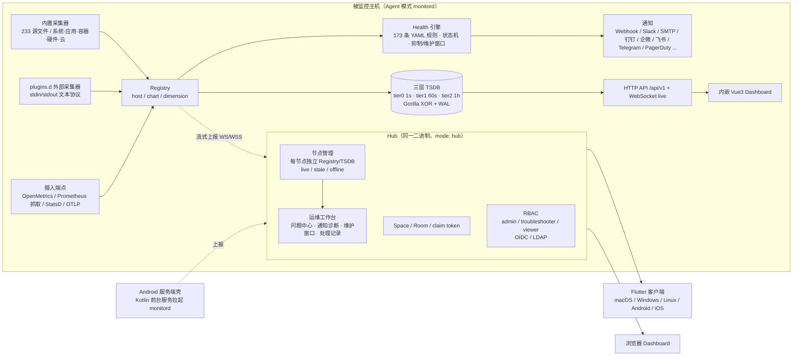

### 3.1 组件职责

| 组件 | 目录 | 说明 |
| --- | --- | --- |
| `monitord` | `core/` | Go 单二进制；`mode: agent` 本机采集 + 本地 UI，`mode: hub` 聚合多节点 |
| 采集器 | `core/internal/collect/` | 系统（cpu/mem/disk/net/sensors）、Linux proc 深度、应用（nginx/mysql/postgres/redis/kafka/es 等约百余个）、容器、Kubernetes、硬件（ipmi/smartctl/nvidia）、云平台、合成检查、Windows Perflib、FreeBSD、macOS、SNMP |
| TSDB | `core/internal/tsdb/` | tier0 1s / tier1 60s（默认 90 天）/ tier2 3600s（默认 2 年），自动选层，离线备份/恢复 |
| Health | `core/internal/health/` | 语义对齐 health.d：`on/lookup/calc/warn/crit/every/delay/repeat`，`for`/`keep_firing_for`/`recovery`，依赖抑制，值班窗口 |
| 流式 / Hub | `core/internal/stream/`, `core/internal/hub/` | Agent→Hub WebSocket，断线有界队列 + 指数退避 + TSDB 回放；Hub 端 claim、Space/Room、`hub.peers` 环形复制、ACLK（MQTT over WSS） |
| Web | `web/` | Vue 3 + TS + uPlot，视口懒加载、WS 增量刷新、54 个预置聚合看板、运维工作台 |
| 客户端 | `app/` | Flutter：连接 Agent/Hub、节点切换、图表懒加载、告警、Functions、凭据安全存储 |
| Android 服务端 | `android/` | Kotlin 前台服务拉起随包静态 `monitord`（arm64），可设端口、上报 Hub、开机自启 |
| 发布 | `.github/workflows/` | `ci.yml` 矩阵测试；`release.yml` 推送 main 自动打 tag、构建全部安装包、生成 SHA256SUMS |

### 3.2 数据流

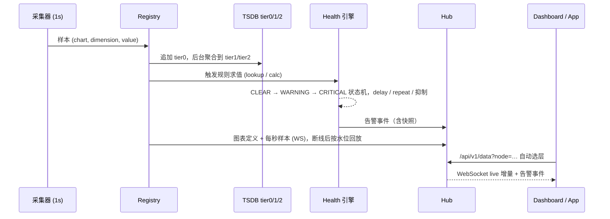

---

## 4. 已完成能力矩阵

### 4.1 服务端核心

| 能力 | 状态 | 关键点 |
| --- | --- | --- |
| 秒级零配置采集 | ✅ | 自动探测、动态注册；233 个采集器源文件 |
| plugins.d 外部采集器 | ✅ | 行文本协议、崩溃退避重启（1s→60s）、看门狗 |
| 摄入端点 | ✅ | OpenMetrics POST、Prometheus 抓取、StatsD UDP :8125、OTLP :4318 |
| 被动外部检查 | ✅ | `POST /api/v1/checks`，TTL 过期标记 |
| 三层 TSDB | ✅ | Gorilla 压缩、WAL、按时间/容量保留、自动选层、备份/恢复 |
| Functions | ✅ | processes / disks / mounts / network-interfaces / network-connections 实时表，Hub 透传 |
| Prometheus 导出 | ✅ | `/api/v1/allmetrics?format=prometheus` |
| ML 异常检测 / 关联分析 | ✅ | Metric Correlations（ks2/volume）、异常顾问、图上异常维度标红 |

### 4.2 健康 / 告警 / 通知

| 能力 | 状态 |
| --- | --- |
| YAML 规则引擎（兼容 health.d 写法）、173 条内置规则 | ✅ |
| 告警状态机、滞回、`delay`/`repeat`、`for`/`keep_firing_for`、`recovery` 表达式 | ✅ |
| 依赖抑制 `health.inhibit`、值班窗口 `health.oncall`、`escalate_to`、`group_wait` 合并 | ✅ |
| 计划维护窗口（立即/预约、按告警或全局、重启保留） | ✅ |
| 通知：Webhook、Slack/Mattermost、SMTP（TLS）、钉钉、企业微信、飞书（签名）、Telegram、Discord、PagerDuty、ntfy、Gotify、Bark | ✅ |
| 通知诊断面板（队列、通道接受/失败/抑制原因、测试发送） | ✅ |
| 本机告警规则工作台（JSON 编辑、预览、原子保存、409 并发保护） | ✅ |

### 4.3 Hub / 多节点 / 安全

| 能力 | 状态 |
| --- | --- |
| Agent→Hub 流式上报，断线回放 | ✅ |
| 每节点独立 Registry/TSDB、live/stale/offline、`node=` 全 API 选择 | ✅ |
| claim token 认领、Space→Room 组织、配置下发、`hub.peers` 集群复制 | ✅ |
| ACLK（MQTT 3.1.1 over WSS）、Cloud 控制台 | ✅ |
| RBAC 三级角色、默认随机管理员密码（0600）、OIDC（PKCE）、LDAP | ✅ |
| `allow_from` CIDR、配置原子写入 + `.bak`、只读分享链接 | ✅ |

### 4.4 Dashboard / 运维工作台

| 能力 | 状态 |
| --- | --- |
| 按 family 分组图表、懒加载、WS 实时增量、时间窗 1 分钟～7 天 | ✅ |
| 运维总览：节点资源、连接状态、数据新鲜度、问题列表 | ✅ |
| 问题中心：确认/撤销/备注、责任人指派、处理进度、批量处置（≤50 项原子提交） | ✅ |
| 处理记录查询 + JSON/CSV 导出；个人视图服务端保存（每账号 10 个） | ✅ |
| 54 个预置聚合看板 + 个人看板（导入导出、时段对比、CSV 导出） | ✅ |
| 本机配置编辑器（YAML + 表单、CAS、回滚、重启接口） | ✅ |
| 中文指标说明（每张图内置解释） | ✅ |

### 4.5 客户端与移动端

| 能力 | 状态 |
| --- | --- |
| Flutter 五端：连接 Agent/Hub、节点切换、图表懒加载实时订阅、告警、Functions、凭据安全存储、后台暂停轮询 | ✅ |
| Android 服务端壳：前台服务、端口设置、上报 Hub、开机自启、打开内嵌 Dashboard | ✅ |
| Flutter 端的 2.0 运维工作台处置界面 | ⏳ 未落地（见第 8 节） |

---

## 5. 界面实测（v2.0.25，云主机真实运行）

部署方式：从 GitHub Release 下载 `monitord-v2.0.25-linux-amd64.tar.gz`，校验 `SHA256SUMS.txt`（`e345724f…5f404` 一致），`monitord -version` → `monitord v2.0.25 linux/amd64`。同机启动 Hub（`:19999`，`demo-hub`）+ Agent（`:19998`，`demo-agent`，流式上报到 Hub）。

### 5.1 运维总览
先看问题再进主机：受监控节点 2/2 在线、3 条待确认警告、主机资源卡片（CPU/内存/挂载点使用率）。

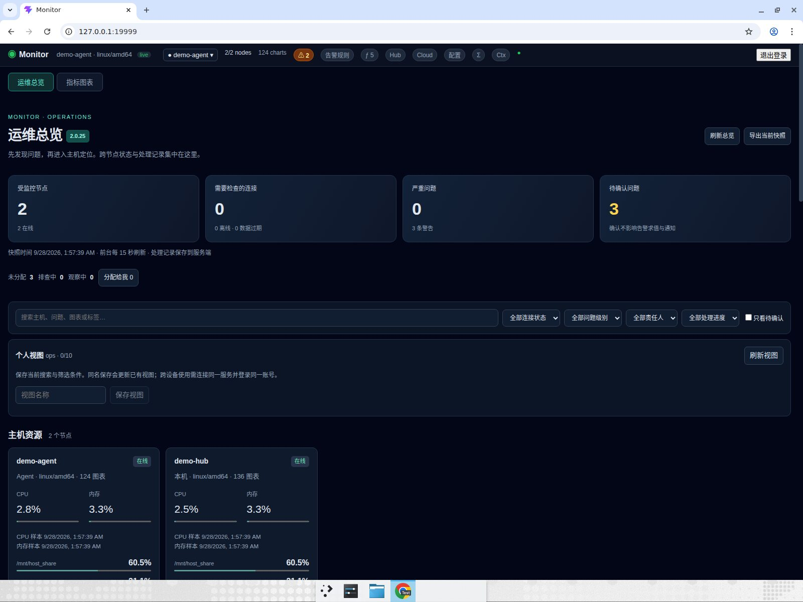

### 5.2 问题中心
每条问题可确认、指派责任人、设置处理进度、备注，支持批量处置；远端 Agent 的告警（`demo_ram_warning`）与本机告警在同一列表。


### 5.3 指标图表
Hub 视图下节点卡片显示 demo-hub 136 张图、demo-agent 124 张图；按 system/mem/cpu/disk/net/ipv4/… 分组，1 秒粒度实时刷新，每张图带"中文指标说明"和 CSV 导出。

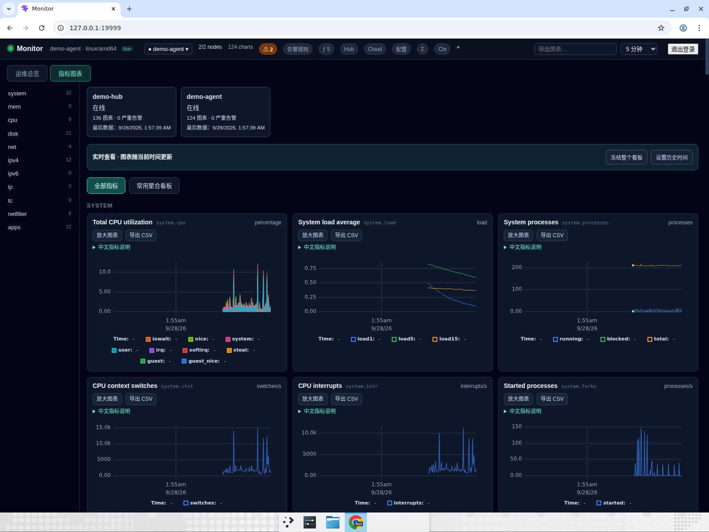

### 5.4 常用聚合看板（54 个内置样板）
研发总览、资源瓶颈、MySQL/PostgreSQL/Redis 排障、Kubernetes、GPU、TCP 连接排障、证书巡检、Windows/macOS/Android 主机等，按当前节点已采集数据自动匹配。

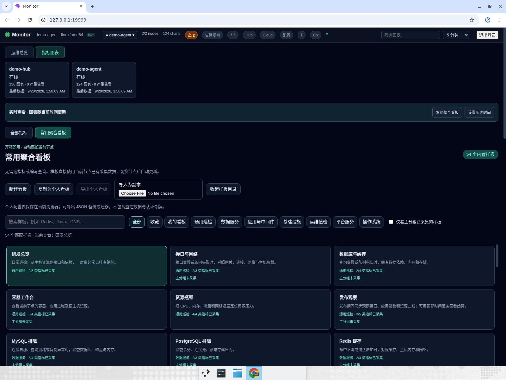

### 5.5 告警面板
demo-agent 上 46 条规则求值：2 条 WARNING（`10min_tcp_retransmits`、`demo_ram_warning`），其余 CLEAR，列出图表、当前值、持续时间。

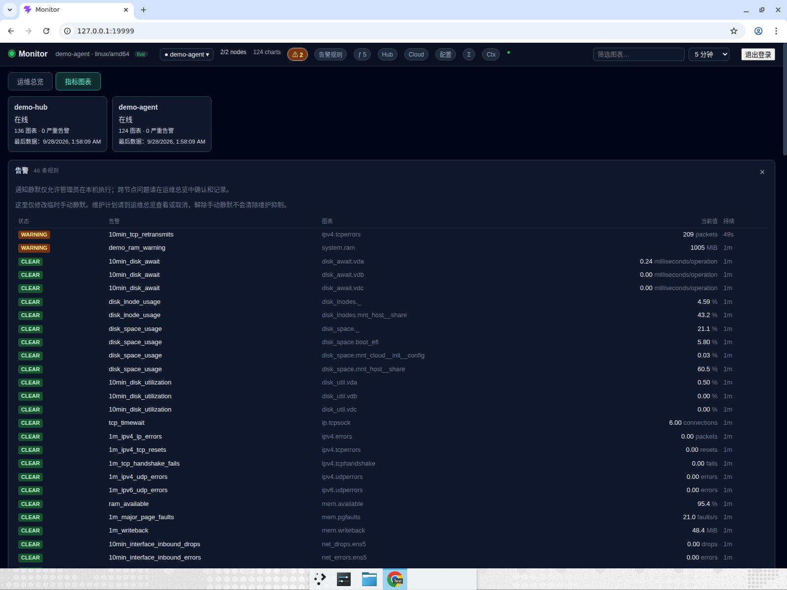

### 5.6 告警规则工作台
173 条内置规则可检索、查看 JSON 定义（`lookup`/`warn`/`crit`/`delay`），新建、编辑、禁用、校验并预览。

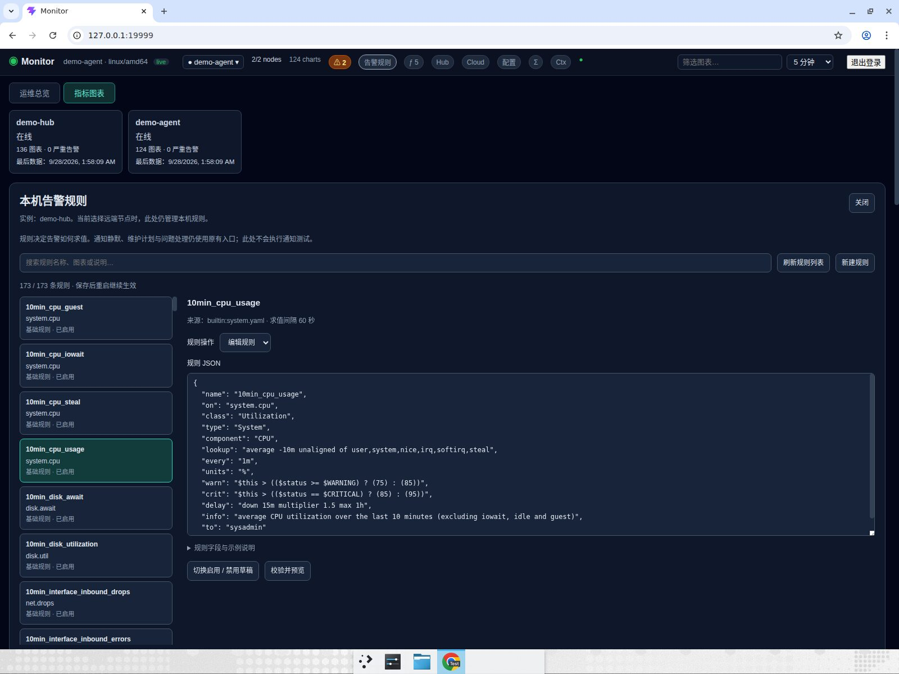

### 5.7 Functions：实时进程表
`processes` 函数返回 200/210 行进程快照（pid、组、CPU、RSS、线程、命令行），两个 `monitord` 进程各占约 35～52 MiB 内存、2% CPU。

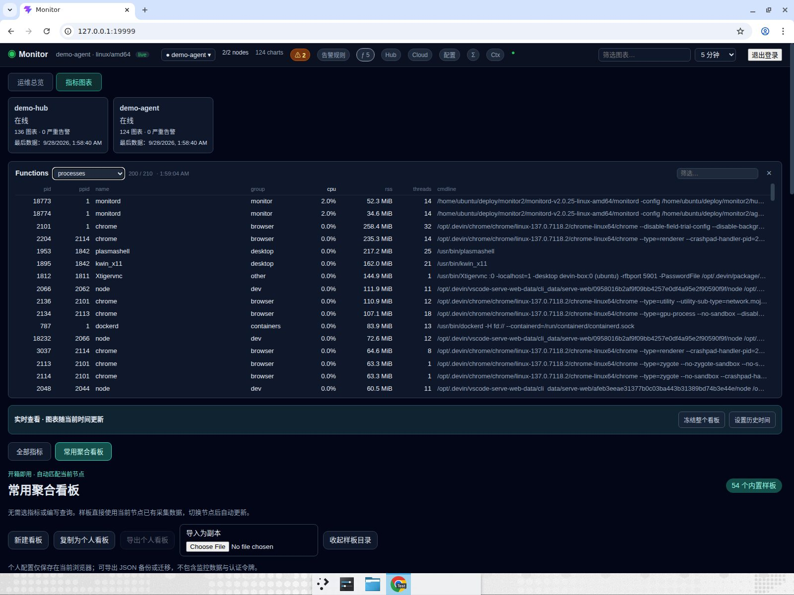

### 5.8 Hub 管理：Space / Room / claim token
创建 Space 与 Room，签发一次性 claim token，Agent 连接后换成长期 stream key 并归入 Room；支持只读分享链接。

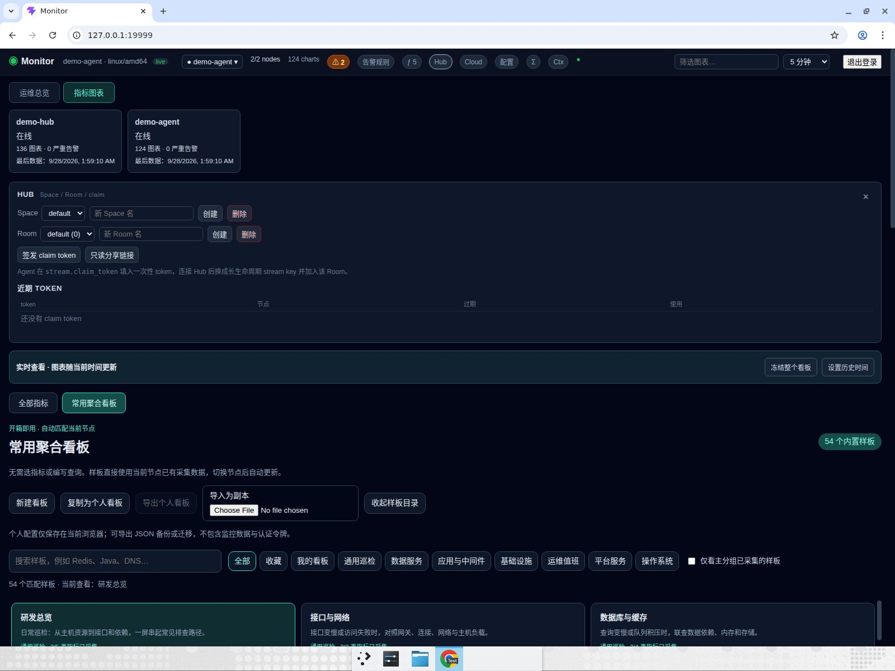

### 5.9 断线 / 恢复（v0.1.2 阶段实测）
早期在 v0.1.2 完成的两进程故障演练：`kill -9` Agent 后 Hub 头部显示 `offline`、`1/2 nodes`；重启 Agent 后恢复 `live`、`2/2 nodes`，图表恢复推进（SIGKILL 期间存在预期的数据缺口）。完整过程有录屏。

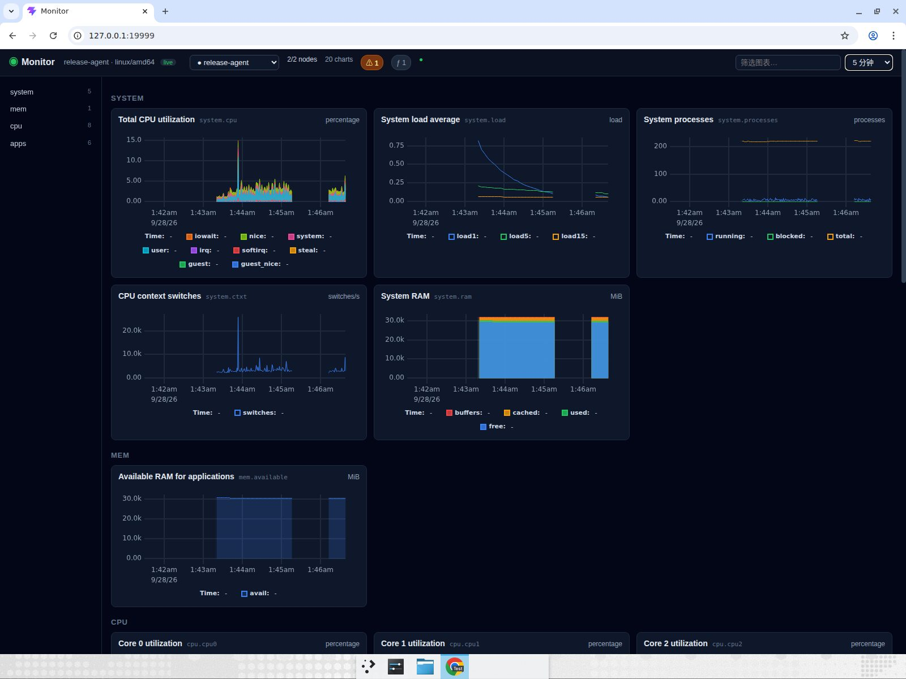

---

## 6. 发布与交付

### 6.1 自动发布流水线

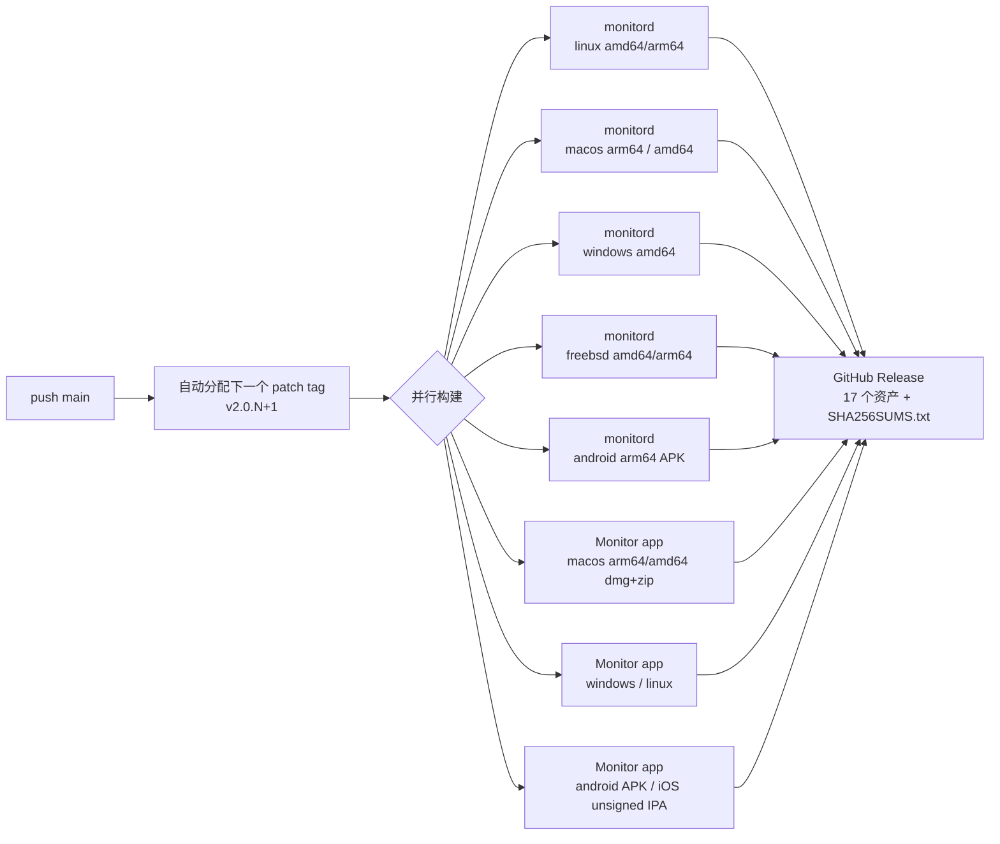

- 触发：推送 `main` 自动打 tag；手动推 `v*` tag 可升 minor/major；`workflow_dispatch` 可重建。
- v2.0.25 Release 由 GitHub Actions 于 2026-09-28 01:46 UTC 发布，对应提交 `ce12209`。

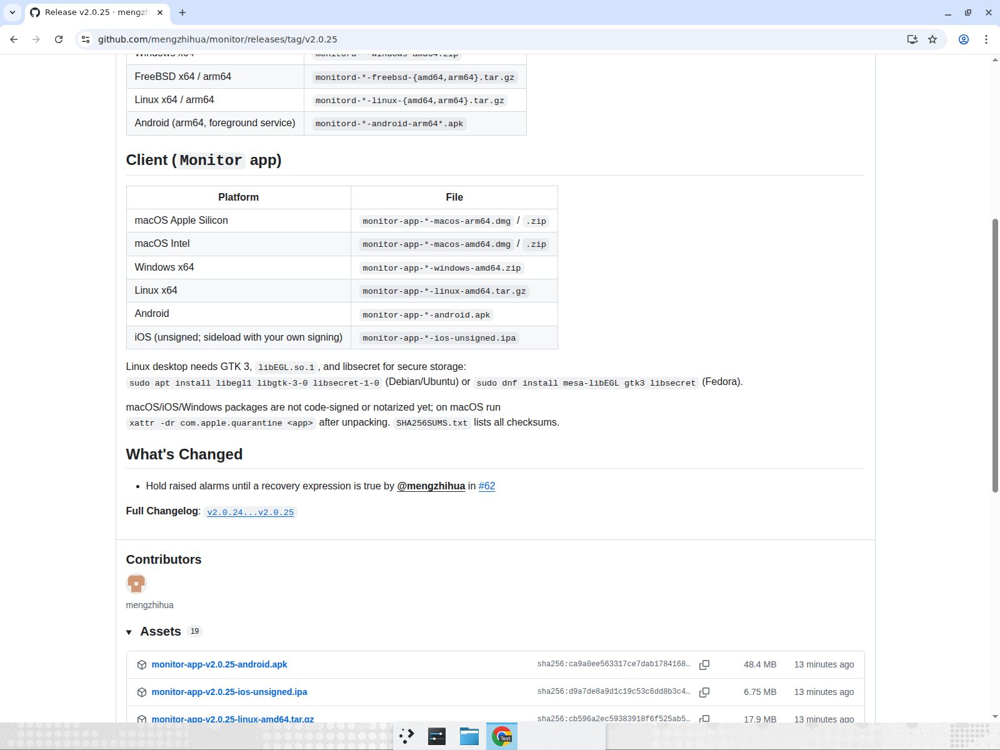

### 6.2 v2.0.25 资产清单

| 类别 | 平台 | 文件 |
| --- | --- | --- |
| 服务端 | Linux x64 / arm64 | `monitord-v2.0.25-linux-{amd64,arm64}.tar.gz` |
| 服务端 | macOS Apple Silicon / Intel | `monitord-v2.0.25-macos-{arm64,amd64}.tar.gz` |
| 服务端 | Windows x64 | `monitord-v2.0.25-windows-amd64.zip` |
| 服务端 | FreeBSD x64 / arm64 | `monitord-v2.0.25-freebsd-{amd64,arm64}.tar.gz` |
| 服务端 | Android arm64 | `monitord-v2.0.25-android-arm64-unsigned.apk` |
| 客户端 | macOS Apple Silicon / Intel | `monitor-app-v2.0.25-macos-{arm64,amd64}.dmg` / `.zip` |
| 客户端 | Windows x64 | `monitor-app-v2.0.25-windows-amd64.zip` |
| 客户端 | Linux x64 | `monitor-app-v2.0.25-linux-amd64.tar.gz` |
| 客户端 | Android | `monitor-app-v2.0.25-android.apk` |
| 客户端 | iOS | `monitor-app-v2.0.25-ios-unsigned.ipa` |
| 校验 | — | `SHA256SUMS.txt` |

---

## 7. 质量与测试

| 项目 | 结果 |
| --- | --- |
| `cd core && go test ./...` | 17 个包 `ok`，0 失败（`internal/collect` 21.9s、`internal/api` 12.1s，其余 <1.5s） |
| Go 测试代码量 | 25,798 行（约为业务代码的 39%） |
| CI 矩阵 | ubuntu / macos / windows 单测 + `make cross` 交叉编译 + web 构建，每个 PR 必过 |
| 端到端浏览器测试 | M0 Dashboard、M2 Hub 多节点（录屏）、v0.1.2 云主机部署与断线恢复（录屏）、v2.0.25 云主机全界面走查（本文截图） |
| 代码审查 | 每个 PR 经自动审查，累计修复 Prometheus 元数据重复、TSDB 刷盘乱序、WS Origin/CORS、token 模式 UI、告警快照、回放水位等数十项 |

### 7.1 里程碑与 PR 轨迹

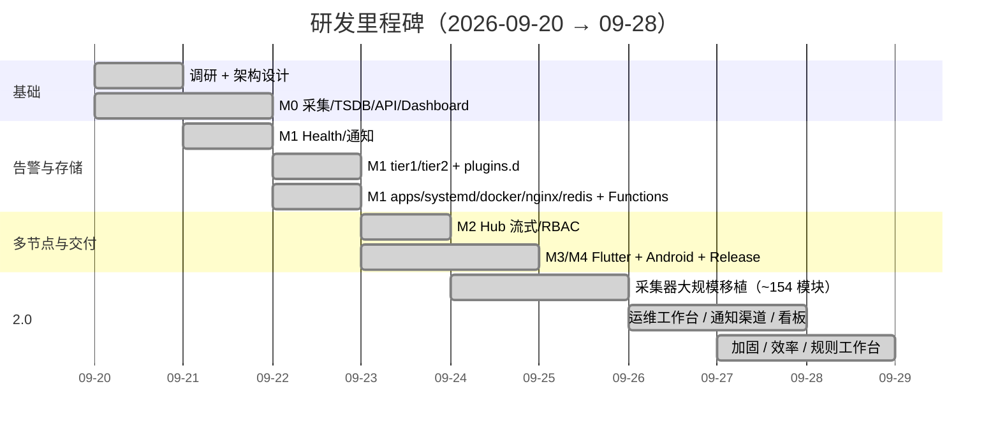

---

## 8. 与 Netdata 的对照与明确边界

| Netdata 能力 | Monitor 现状 |
| --- | --- |
| 秒级采集、零配置 | ✅ 对齐 |
| go.d 应用采集器 | ✅ 约 154 个模块自研移植（除 testrandom） |
| plugins.d 协议 | ✅ 兼容语义 |
| dbengine 多层存储 | ✅ 自研三层 TSDB |
| health.d 规则 | ✅ 173 条内置，语法兼容 |
| 通知渠道 | ✅ 12+ 渠道，含国内钉钉/企微/飞书/Bark |
| Streaming / Parent-Child | ✅ Agent→Hub，`hub.peers` 复制 |
| Netdata Cloud（Space/Room/ACLK） | ✅ 本地化实现，不对接 netdata.cloud 账号 |
| ML 异常检测 / Metric Correlations | ✅ |
| Functions（processes 等） | ✅ 5 个内置 |
| eBPF 采集 | ⚠️ 有 eBPF 程序族，CO-RE/BTF 重定位不进默认二进制 |
| 850+ Prometheus 集成名 | ⚠️ 走通用 `prom.*` 抓取 profile，不逐个手写 |
| charts.d bash 编排器 | ❌ 不内嵌（可用 plugins.d 替代） |

**已明确不承诺 / 尚未完成的项（如实汇报）：**

- Android：当前是"Kotlin 壳 + 随包静态 `monitord`"；进程内 gomobile 嵌入与 Kotlin 采集桥仍是设计目标，Android 上外部 plugins.d 采集器不可用（无法 fork）。
- Flutter 客户端未覆盖 2.0 运维工作台的处置界面（确认/指派/批量）。
- 告警汇总最多两跳；用户已读回执、工单状态回写、SLO、分布式追踪未实现。
- Hub 无共识选主 / 完整 HA；不承诺任意故障零丢失。
- 通知诊断计数重启清空、不汇总远端 Agent；维护计划不下发远端 Agent。
- macOS/iOS/Windows 包尚未代码签名与公证（macOS ad-hoc 签名，Android APK 未签名除非配置 secrets）。
- 1000 节点验收为模拟节点合成数据；72 小时稳定性与 Android/iOS 真机验收未完成。
- 已知待修：TSDB `TierCovers` 与读取时保留期截断口径不一致；高并发推送下自动 tag 分配不保证严格提交顺序。

---

## 9. 路线图

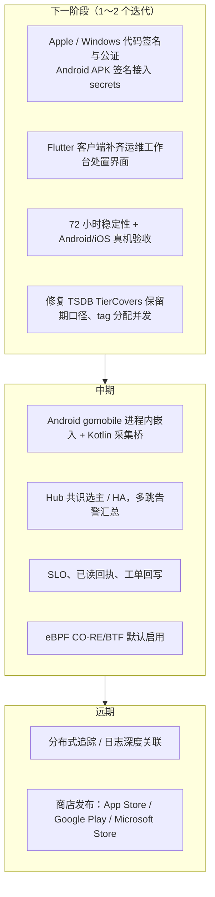

---

## 10. 数据来源

| 数据 | 命令 / 位置 |
| --- | --- |
| 提交数 189、时间范围 | `git log --oneline \| wc -l`、`git log --reverse --format=%as` |
| 已合并 PR 62 | `gh pr list --state merged --limit 200 \| wc -l` |
| 代码行数 | `find core -name '*.go' ! -name '*_test.go' \| xargs wc -l` 等 |
| 采集器源文件 233 | `find core/internal/collect -name '*.go' ! -name '*_test.go' \| wc -l` |
| 健康规则 173 | `grep '^\s*-\s*name:' core/internal/health/rules/*.yaml` |
| Release 资产 | `gh release view v2.0.25 --json assets` |
| 测试结果 | `cd core && go test ./...`（Go 1.25） |
| 界面截图 | v2.0.25 Linux 发布包，Hub `127.0.0.1:19999` + Agent `127.0.0.1:19998`，Chrome 实拍 |
| 相关文档 | `docs/01`～`docs/13`（调研、架构、协议、差距、验收、2.0、通知、看板、加固、效率、规则工作台） |
